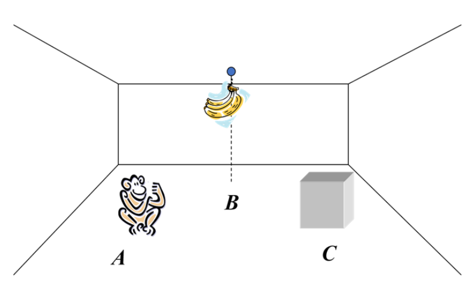

# 课后作业

 ## 1. 用一阶谓词表示方法描述“猴子摘桃”系统。

| 性能                   | 环境                                         | 执行器                                               | 感知器                                       |
| ---------------------- | -------------------------------------------- | ---------------------------------------------------- | -------------------------------------------- |
| 猴子站在箱子上摘到香蕉 | banana box 地面二维平面位置  (pos) | （monkey）  Move Jump Push Grasp | （眼睛） At Hold On Hang |

### 1) 定义描述环境状况的谓词

At(D, pos)：D在pos位置	个体域：D?{monkey,box,banana} pos?{x,y} x?{平面横坐标} y?{平面纵坐标}
On(pos)：monkey在pos位置的box上站着	

Hang(pos)：banana在pos位置上空悬挂着

Hold (pos)：monkey在pos位置上拿着banana

### 2) 使用谓词、连接词、量词来表示环境状态

**初始状态：**
$$
S_0 = At(monkey, posA) \cap At(banana, posB) \cap At(box, posC) \cap Hang(posB) \cap !Hold(posA) \cap  !On(posA)
$$
**目标状态：**
$$
S_g = At(monkey, posB) \cap At(banana, posB) \cap At(box, posB) \cap !Hang(posB) \cap Hold(posB) \cap  On(posB)
$$

### 3) 定义四个操作

**Move(u, v) :** monkey从u走到v

**Push(u, v)：** monkey把箱子从u推到v

**Jump():** monkey跳上箱子

**Grasp():** monkey摘下香蕉

### 4) 各种操作的条件和动作

Move(u, v)

**条件：** !On(u)、 At(monkey, u)

**动作：** 删除表： At(monkey, u)	添加表：At(monkey, v)

Push(u, v)

**条件：** !On(u)、 At(monkey, u), At(box, u)

**动作：** 删除表： At(monkey, u), At(box, u)

​			添加表:	At(monkey, v), At(box, v)

Jump()

**条件：** !On(posC)、 At(monkey, posC)

**动作：** 删除表： !On(posC)	添加表：On(posC)

Grasp()

**条件：** On(posB)、 At(box, posB)、 Hang(posB)、 !Hold(posB)

**动作：** 删除表：Hang(posB),  !Hold(posB)

​			添加表：!Hang(posB),  Hold(posB)

### 5) 猴子摘香蕉求解过程

$$
S_0 = At(monkey, posA) \cap At(banana, posB) \cap At(box, posC) \cap Hang(posB) \cap !Hold(posA) \cap  !On(posA)
$$

Move(posA, posC)
$$
S_1 = At(monkey, posC) \cap At(banana, posB) \cap At(box, posC) \cap Hang(posB) \cap !Hold(posC) \cap  !On(posC)
$$
Push(posC, posB)
$$
S_2 = At(monkey, posB) \cap At(banana, posB) \cap At(box, posB) \cap Hang(posB) \cap !Hold(posB) \cap  !On(posB)
$$
Jump()
$$
S_3 = At(monkey, posB) \cap At(banana, posB) \cap At(box, posB) \cap Hang(posB) \cap !Hold(posB) \cap  On(posB)
$$
Grasp()
$$
S_g = At(monkey, posB) \cap At(banana, posB) \cap At(box, posB) \cap !Hang(posB) \cap Hold(posB) \cap  On(posB)
$$

## 2.   用产生式表示方法描述“猴子摘桃”系统。

 

 ### 1) 综合数据库：（posA, posB, posC, On, Hold）

**posA：** 猴子位置

**posB：** 香蕉位置

**posC：** 箱子位置

**On = 0：** 猴子在地上

**On = 1：** 猴子在箱子上

**Hold = 0：** 猴子没有抓到香蕉

**Hold = 1：** 猴子抓到了香蕉

### 2) 初始状态：（posA, posB, posC, 0, 0）

### 3) 结束状态：（posB, posB, posB, 1, 1）

### 4) 规则集：

r1. 猴子可以随意走：
$$
r_1 = IF(x, y, z, 0, 0) THEN(w, y, z, 0, 0)
$$
r2. 猴子可以推着箱子随意走：
$$
r_2 = IF(x, y, x, 0, 0) THEN(w, y, w, 0, 0)
$$
r3. 猴子和箱子在同一位置时可以跳上箱子：
$$
r_3 = IF(x, y, x, 0, 0) THEN(x, y, x, 1, 0)
$$
r4. 猴子和箱子在同一位置时可以跳下箱子：
$$
r_4 = IF(x, y, x, 1, 0) THEN(x, y, x, 0, 0)
$$
r5. 猴子在箱子上，且在香蕉所在位置，可以摘下香蕉：
$$
r_5 = IF(x, x, x, 1, 0) THEN(x, x, x, 1, 1)
$$
**解：**

根据具体问题可以将规则具体为

 
$$
r_1 = IF(posA, posB, posC, 0, 0) THEN(posC, posB, posC, 0, 0)
$$

$$
r_2 = IF(posC, posB, posC, 0, 0) THEN(posB, posB, posB, 0, 0)
$$

$$
r_3 = IF(posB, posB, posB, 0, 0) THEN(posB, posB, posB, 1, 0)
$$

$$
r_4 = IF(posB, posB, posB, 1, 0) THEN(posB, posB, posB, 1, 1)
$$

在已知事实下，
$$
r_1 \to r_2 \to r_3 \to r_4
$$
如此可得到香蕉。

