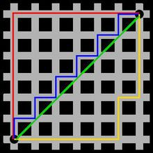
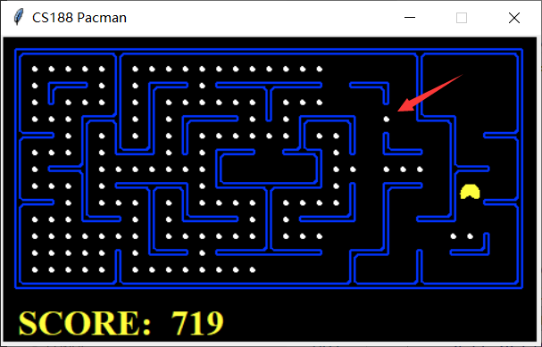
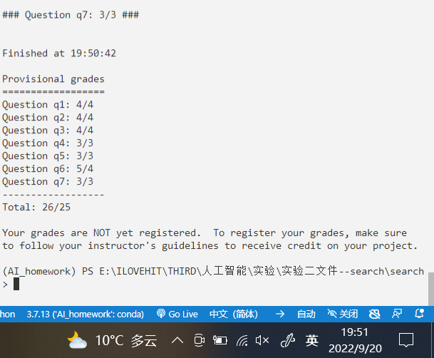

- [食豆人](#---)
  * [准备工作](#----)
    + [1. 食豆人的可操作的类方法](#1------------)
    + [2. 查看可用的数据结构](#2----------)
  * [search.py](#searchpy)
    + [问题一：使用深度优先搜索查找固定的食物点](#--------------------)
    + [问题二：广度优先搜索](#----------)
    + [问题三：A* 算法](#----a----)
  * [searchAgents.py](#searchagentspy)
    + [4. 找到所有的角落](#4--------)
    + [5. 角落问题（启发式）](#5----------)
    + [6. 吃掉所有的豆子](#6--------)
    + [7. 次最优搜索](#7------)
  * [过啦！](#---)


# 食豆人

## 准备工作

[实验传送门(UC Berkeley CS188 Intro to AI)](http://ai.berkeley.edu/project_overview.html)

顺便安利一个为Github添加目录的网站，将markdown粘到里面，就可以转化为Github可见的目录。\^_\^

<small><i><a href='http://ecotrust-canada.github.io/markdown-toc/'>Table of contents generated with markdown-toc</a></i></small>

### 1. 食豆人的可操作的类方法

查看`searchAgents.py`中<font color=blue>**PositionSearchProblem**</font>类中的各个成员函数的功能以及返回制类型，便于后续使用函数中传入的<font color=green>**problem**</font>实例

看完源码之后可以在`search.py`中往上翻翻，<font color=blue>**class SearchProblem**</font>类中可以看到关于problem实例的功能解释（作者真是太体贴了，呜呜呜\~）。

```python
# 可在传入 problem 类实例的函数中输出查看具体的成员函数返回值
# 返回起点位置(x, y)
print("Start:", problem.getStartState())

# 判断传入的位置是否为目标终点
# 返回 True/False
print("Is the start a goal?", problem.isGoalState(problem.getStartState()))

# expand函数中综合了其他几个类成员函数，将中间的处理过程封装了
# 返回(可以走的下一个位置坐标，方向，距离) 即((x,y), 'East', 1)
print("expand:", problem.expand(problem.getStartState())) 

# 获取下一步可以前进的方向
# 返回 ['South', 'West']，表示下一步可以往南或者往西走
print("get_Action:", problem.getActions(problem.getStartState()))

# 获取一系列actions的花费，即所有动作走过的距离
def getCostOfActionSequence(self, actions):
    """
        actions: A list of actions to take

    This method returns the total cost of a particular sequence of actions.
    The sequence must be composed of legal moves.
    """
```

### 2. 查看可用的数据结构

在`util.py`中提供了几种数据结构：**栈**，**队列**，**优先队列(小根堆)**

查看其可用的操作

```python
"""
 Data structures useful for implementing SearchAgents
"""

class Stack:
    "A container with a last-in-first-out (LIFO) queuing policy."
    def __init__(self):
        self.list = []

    def push(self,item):
        "Push 'item' onto the stack"
        self.list.append(item)

    def pop(self):
        "Pop the most recently pushed item from the stack"
        return self.list.pop()

    def isEmpty(self):
        "Returns true if the stack is empty"
        return len(self.list) == 0

class Queue:
    "A container with a first-in-first-out (FIFO) queuing policy."
    def __init__(self):
        self.list = []

    def push(self,item):
        "Enqueue the 'item' into the queue"
        self.list.insert(0,item)

    def pop(self):
        """
          Dequeue the earliest enqueued item still in the queue. This
          operation removes the item from the queue.
        """
        return self.list.pop()

    def isEmpty(self):
        "Returns true if the queue is empty"
        return len(self.list) == 0

class PriorityQueue:
    """
      Implements a priority queue data structure. Each inserted item
      has a priority associated with it and the client is usually interested
      in quick retrieval of the lowest-priority item in the queue. This
      data structure allows O(1) access to the lowest-priority item.
    """
    def  __init__(self):
        self.heap = []
        self.count = 0

    def push(self, item, priority):
        entry = (priority, self.count, item)
        heapq.heappush(self.heap, entry)
        self.count += 1

    def pop(self):
        (_, _, item) = heapq.heappop(self.heap)
        return item

    def isEmpty(self):
        return len(self.heap) == 0

    def update(self, item, priority):
        # If item already in priority queue with higher priority, update its priority and rebuild the heap.
        # If item already in priority queue with equal or lower priority, do nothing.
        # If item not in priority queue, do the same thing as self.push.
        for index, (p, c, i) in enumerate(self.heap):
            if i == item:
                if p <= priority:
                    break
                del self.heap[index]
                self.heap.append((priority, c, item))
                heapq.heapify(self.heap)
                break
        else:
            self.push(item, priority)
            
class PriorityQueueWithFunction(PriorityQueue):
    """
    Implements a priority queue with the same push/pop signature of the
    Queue and the Stack classes. This is designed for drop-in replacement for
    those two classes. The caller has to provide a priority function, which
    extracts each item's priority.
    """
    def  __init__(self, priorityFunction):
        "priorityFunction (item) -> priority"
        self.priorityFunction = priorityFunction      # store the priority function
        PriorityQueue.__init__(self)        # super-class initializer

    def push(self, item):
        "Adds an item to the queue with priority from the priority function"
        PriorityQueue.push(self, item, self.priorityFunction(item))
```

还有计算曼哈顿距离的函数，后面计算A\*的估价函数时要用

```python
def manhattanDistance( xy1, xy2 ):
    "Returns the Manhattan distance between points xy1 and xy2"
    return abs( xy1[0] - xy2[0] ) + abs( xy1[1] - xy2[1] )

"""
  Data structures and functions useful for various course projects

  The search project should not need anything below this line.
"""
```


<font color=red size=4>收获：</font>为了使版本之间更好的兼容，可以自己实现一些必要的数据结构。在实现功能时，使用自带的数据结构操作，可以防止不同版本之间如果有函数接口上的变化，导致运行出错。


## search.py

### 问题一：使用深度优先搜索查找固定的食物点

在`my_dfs()`最后发现将一个列表存入另一个列表的一个小问题，详见代码

```python
def depthFirstSearch(problem):
    """
    Search the deepest nodes in the search tree first.

    Your search algorithm needs to return a list of actions that reaches the
    goal. Make sure to implement a graph search algorithm.

    To get started, you might want to try some of these simple commands to
    understand the search problem that is being passed in:

    print("Start:", problem.getStartState())
    print("Is the start a goal?", problem.isGoalState(problem.getStartState()))
    """
    "*** YOUR CODE HERE ***"
    open_table = util.Stack()
    return my_dfs(problem, open_table)
    # util.raiseNotDefined()

def my_dfs(problem, open_table):
    vis = []
    open_table.push([problem.getStartState(), []])

    while not open_table.isEmpty():
        now_state, road_records = open_table.pop()

        if problem.isGoalState(now_state):
            return road_records
        if now_state not in vis:
            vis.append(now_state)
            for next_state in problem.expand(now_state):
                print(next_state)
                open_table.push([next_state[0], road_records + [next_state[1]]])
    return []
```

### 问题二：广度优先搜索

```python
def breadthFirstSearch(problem):
    """Search the shallowest nodes in the search tree first."""
    "*** YOUR CODE HERE ***"
    open_table = util.Queue()
    return my_bfs(problem, open_table)
    # util.raiseNotDefined()

def my_bfs(problem, opent_able):
    vis = []
    road_records = []
    opent_able.push([problem.getStartState(), road_records])
    vis.append(problem.getStartState())
    
    while not opent_able.isEmpty():
        now_state, new_road_records = opent_able.pop()
        if problem.isGoalState(now_state):
            return new_road_records
        next_states = problem.expand(now_state)
        for next_state in next_states:
            if next_state[0] in vis:
                continue
            vis.append(next_state[0])
            opent_able.push([next_state[0], new_road_records + [next_state[1]]])

    return []
```

### 问题三：A* 算法

参考博客： [A*搜索算法_长生但酒狂的博客-CSDN博客_a*搜索](https://blog.csdn.net/qq_28299311/article/details/103292739)

> 算法思路：
>
> A\*算法是一种**启发式**搜索，相比于dfs和bfs盲目遍历整张地图，A\*在**Dijkstra**的基础上，通过评估函数选择一条尽可能快速逼近终点的路径进行搜索。

评估函数
$$
f(n) = h(n) + g(n)
$$
$h(n)$ 表示从相邻点到达目标点的**估计距离**

$g(n)$ 表示从起点到达当相邻点 $n$ 的**实际距离**

$f(n)$ 表示在 $n$  处从起点到终点的**综合估计值**

**估计函数**对于距离的估计方法有很多，常用的有基于**曼哈顿距离**、**欧拉距离**、**切比雪夫距离**等进行估计。



> **曼哈顿距离：**如上图中红色所示，蓝色和黄色与其等价。
>
> 计算公式：$dis = |x_1 - x_2| + |y_1 - y_2|$


> **欧拉距离：**如上图绿色所示。
>
> 计算公式：$dis = \sqrt{(x_1 - x_2)^2 + (y_1-y_2)^2}$


>**切比雪夫距离：**
>
>在数学中，切比雪夫距离（Chebyshev distance）或是L∞度量，是向量空间中的一种度量，二个点之间的距离定义是其各坐标数值差绝对值的最大值。
>
>国际象棋棋盘上二个位置间的切比雪夫距离是指王要从一个位子移至另一个位子需要走的步数。由于王可以往斜前或斜后方向移动一格，因此可以较有效率的到达目的的格子。

全局搜索，在`searchAgents.py`中找到了两种估计函数的实现（不找一手，连调用函数输入啥都不知道）

```python
def manhattanHeuristic(position, problem, info={}):
    "The Manhattan distance heuristic for a PositionSearchProblem"
    xy1 = position
    xy2 = problem.goal
    return abs(xy1[0] - xy2[0]) + abs(xy1[1] - xy2[1])

def euclideanHeuristic(position, problem, info={}):
    "The Euclidean distance heuristic for a PositionSearchProblem"
    xy1 = position
    xy2 = problem.goal
    return ( (xy1[0] - xy2[0]) ** 2 + (xy1[1] - xy2[1]) ** 2 ) ** 0.5
```


既然**A\***是**Dijkstra**的改进，那先回味一下DJ是什么?

每次走下一个点的决策方法是**贪心**，选择边权最小的下一个点，不断更新最短路径的结果。每次选择一个最近的点加入已遍历的节点集合，通过该点更新最短路径（判断是否到达同样的位置是否能够通过新加入的点做中转而使路径变小）。

下面放一段鄙人年轻的时候写的堆优化**Dj**。

```c++
typedef pair<int,int> PII; // first 存距离   second 存编号 

int dijkstra() {
	dist[1] = 0; // 第一个点到起点的距离
	
	priority_queue<PII, vector<PII>, greater<PII>> heap; // 小根堆 
	heap.push({0,1});
	
	while(heap.size()) { // 堆不空 
		PII t = heap.top();
		heap.pop();
		
		int ver = t.second, dis = t.first;
		if(st[ver]) continue; // 重边（访问过的）就不用再更新了，DJ思想就是贪心的访问每条最短边
		st[ver] =  true; // 标记 t 已经确定为最短路
		
		for(int i = head[ver]; i; i = e[i].next) {
			int to = e[i].to;
			if(dist[to] > dis + e[i].w) {
				dist[to] = dis + e[i].w;
				heap.push({dist[to], to});
			}
		} 
	} 
} 
```

那么**A\***就是将下一步**选择的路径的贪心**方法从**单纯的边权**变成了带上估计函数运算结果之后的综合估计值$f(n)$

上面的**Dijkstra**代码没有实现路径记录。只需要在每个节点中存储其上一个节点的编号，最后就能f找到一条从终点出发到达起点的路径，将该路径逆序输出，就找到了最短路径。注意在中间更新最短路径的过程中，如果遇到已经访问过的点`node_x`，且其最短路径可以经过包含新加入节点`new_node`的路径而变短，则更新节点`node_x`的上一个节点为`new_node`，这样最后输出的路径才是最短的。

<font color=purple size=6>Some Time Later...</font>

正愁咋写合适呢，猛然忆起第一题中要求尽量把三个函数归结成一个函数，因为他们的区别只有不同之处在于用不同的数据结构对open表进行排序。此时才知道，为啥有了优先队列，还要一个`PriorityQueueWithFunction`,就是用来统一接口的啊！

```python
def aStarSearch(problem, heuristic=nullHeuristic):
    """Search the node that has the lowest combined cost and heuristic first."""
    "*** YOUR CODE HERE ***"
    # 此处的估计函数已经给出是 heuristic，默认是没有估值(相当于没有启发式，直接就是爆搜)
    # open_table_test = util.PriorityQueue() # 由于要统一接口，就不用普通的优先队列了

    # lambda函数，用于给出优先队列排序的判据为 综合估计值f(n)，这样三种搜索的接口就统一了
    priorityFunction = lambda item: problem.getCostOfActionSequence(item[1]) + heuristic(item[0], problem)
    open_table = util.PriorityQueueWithFunction(priorityFunction)
    return my_Astar(problem, open_table)


def my_Astar(problem, open_table):
    vis = []
    open_table.push([problem.getStartState(), []])
    vis.append(problem.getStartState())
    
    while not open_table.isEmpty():
        now_state, new_road_records = open_table.pop()
        if problem.isGoalState(now_state):
            return new_road_records
        next_states = problem.expand(now_state)
        for next_state in next_states:
            if next_state[0] in vis:
                continue
            vis.append(next_state[0])
            open_table.push([next_state[0], new_road_records + [next_state[1]]])
    return []

```

通过上面观察，dfs和bfs写出来的函数是一样的，统一优先队列接口后的A\*算法也一样，那么3个搜索就可以统一使用一个函数了

`search.py`的最终代码如下

```python
def depthFirstSearch(problem):
    """Search the deepest nodes in the search tree first."""
    "*** YOUR CODE HERE ***"
    open_table = util.Stack()
    return general_search(problem, open_table)
    
def breadthFirstSearch(problem):
    """Search the shallowest nodes in the search tree first."""
    "*** YOUR CODE HERE ***"
    open_table = util.Queue()
    return general_search(problem, open_table)
    
def aStarSearch(problem, heuristic=nullHeuristic):
    """Search the node that has the lowest combined cost and heuristic first."""
    "*** YOUR CODE HERE ***"
    # 此处的估计函数已经给出是 heuristic，默认是没有估值(相当于没有启发式，直接就是爆搜)
  
    # lambda函数，用于给出优先队列排序的判据为 综合估计值f(n)，这样三种搜索的接口就统一了
    priorityFunction = lambda item: problem.getCostOfActionSequence(item[1]) + heuristic(item[0], problem)
    open_table = util.PriorityQueueWithFunction(priorityFunction)
    return general_search(problem, open_table)

def general_search(problem, open_table):
    vis = []
    open_table.push([problem.getStartState(), []])

    while not open_table.isEmpty():
        now_state, new_road_records = open_table.pop()
        if problem.isGoalState(now_state):
            return new_road_records

        if now_state not in vis:
            vis.append(now_state)
            for next_state in problem.expand(now_state):
                open_table.push([next_state[0], new_road_records + [next_state[1]]])
    return []
```

## searchAgents.py

### 4. 找到所有的角落

在角落迷宫的四个角上面有四个豆。这个搜索问题要求找到一条访问所有四个角落的最短的路径。

完成searchAgents.py文件中的CornersProblem搜索问题，你需要重新定义状态，使其能够表示角落是否被访问。

<font color=red>注意事项：<br>			1.  state的类型变了，统一使用 [(x, y), your_own_struction]<br>			2. 还是深搜时出现的问题，传参数千万不能传一个list之类的实体，否则实体一改变，传递的参数就算传出去了，也发生了改变</font>

> 该问题主要就是在**state**中增加关于墙角的状态，及时判断是否访问了墙角，并对pacman和墙角的状态进行及时的更新

细节见代码

### 5. 角落问题（启发式）

查清楚**state**的格式

```shell
# 问题的测试命令如下
Python pacman.py -l mediumCorners -p AStarCornersAgent -z 0.5
```

使用的是 **AStarCornersAgent **代理，在`searchAgent.py`中实现如下

```
class AStarCornersAgent(SearchAgent):
    "A SearchAgent for FoodSearchProblem using A* and your foodHeuristic"
    def __init__(self):
        self.searchFunction = lambda prob: search.aStarSearch(prob, cornersHeuristic)
        self.searchType = CornersProblem
```

可以看到使用的类是第四问编写的 **CornersProblem** ，于是可以确定 **state** 的格式为`[(x, y), [0, 0, 0, 0]]`


<font color=blue size=4>任务：</font>建立寻找四个角落的**估计函数**，查看给定的地图信息格式

```python
corners = problem.corners # These are the corner coordinates
walls = problem.walls # These are the walls of the maze, as a Grid (game.py)

"*** YOUR CODE HERE ***"
print('corners:', corners)
print('walls:', walls)

corners: ((1, 1), (1, 12), (28, 1), (28, 12))

walls: 
TTTTTTTTTTTTTTTTTTTTTTTTTTTTTT
TFFFFFFFTFTFTFFFFFFFFFFFFFFTFT
TFFFFFFFTFTFTTTTTTFTTTTTTTFTFT
TFFFFFFFTFFFFFFFFTFFFFFTFTFFFT
TTTTTFTTTTTFTTTFTTFTTTTTFTFTTT
TFFFTFTFTFTFFFTFFFFTFFFFFTFFFT
TFTTTFTFTFTFTTTTTTTTFTTTFTTTFT
TFFFFFFFTFFFFFTTFFFFFTFTFTFFFT
TTTFTFTTTTTTTFTTTTFTTTFTFTFTFT
TFTFFFFFFFFFFFTTFFFFFTFFFFFTFT
TFTFTTTTTFTFTTTTFTFTTTFTTTFTFT
TFFFTFFFFFTFFFFFFTFTFFFTFTTTFT
TFFFTFTTTTTFFFFFFTFTTTFTFFFFFT
TTTTTTTTTTTTTTTTTTTTTTTTTTTTTT
```

**构建估价函数的思路：**
    计算当前点到达四个角落(食物)的最短曼哈顿距离，返回距离任意角(还没有被访问过的)的最大代价。将最大代价放入小顶堆中，这条路被遍历的可能就小，由此选出最优路径。
$$
manhattan\_dis = |x - x_i| + |y - y_i|
$$

$$
h(n) = \max{\{manhattan\_dis(corner_0), manhattan\_dis(corner_1), manhattan\_dis(corner_2), manhattan\_dis(corner_3)\}}
$$

发现求曼哈顿距离的函数

```python
# util.py
def manhattanDistance( xy1, xy2 ):
    "Returns the Manhattan distance between points xy1 and xy2"
    return abs( xy1[0] - xy2[0] ) + abs( xy1[1] - xy2[1] )

"""
  Data structures and functions useful for various course projects

  The search project should not need anything below this line.
"""
```

实现代码如下

```python
def cornersHeuristic(state, problem):

    corners = problem.corners # These are the corner coordinates
    walls = problem.walls # These are the walls of the maze, as a Grid (game.py)

    "*** YOUR CODE HERE ***"
    '''
    思路：
        计算当前点到达四个角落(食物)的最短哈密顿距离，选择距离任意角最近的路
    '''
    food_list = [] # 存储还有食物的角落坐标，即还没访问过的角落
    index = 0
    for is_vis in state[1]:
        if not is_vis:
            food_list.append(corners[index])
        index += 1

    h_n = 0
    for food in food_list:
        dist = util.manhattanDistance(state[0], food)
        if h_n < dist: # 选择最大的访问代价作为估值函数值
            h_n = dist
    
    return h_n
```

<font color=purple size=5>估价函数效果：</font>

可以在官网看到评分标准如下，搜索算法执行时遍历的点越多，分越低

| Number of nodes expanded | Grade |
| ------------------------ | ----- |
| more than 2000           | 0/3   |
| at most 2000             | 1/3   |
| at most 1600             | 2/3   |
| at most 1200             | 3/3   |

(1)使用默认方案，没有估价函数时的结果

```shell
Path found with total cost of 106 in 0.3 seconds
Search nodes expanded: 1966
```

(2)使用上述估价函数，取未访问过的所有食物的最近的曼哈顿距离

```shell
Path found with total cost of 106 in 0.2 seconds
Search nodes expanded: 1136
Pacman emerges victorious! Score: 434
Average Score: 434.0
Scores:        434.0     
Win Rate:      1/1 (1.00)
Record:        Win    
```


### 6. 吃掉所有的豆子

首先看一下评分标准

| Number of nodes expanded | Grade                             |
| ------------------------ | --------------------------------- |
| more than 15000          | 1/4                               |
| at most 15000            | 2/4                               |
| at most 12000            | 3/4                               |
| at most 9000             | 4/4 (full credit; medium)         |
| at most 7000             | 5/4 (optional extra credit; hard) |

可以从检查的命令看到，未修改前，调用的是没有估价函数的A\*算法

```shell
Python pacman.py -l trickySearch -p AStarFoodSearchAgent
```

```python
class AStarFoodSearchAgent(SearchAgent):
    "A SearchAgent for FoodSearchProblem using A* and your foodHeuristic"
    def __init__(self):
        self.searchFunction = lambda prob: search.aStarSearch(prob, foodHeuristic)
        self.searchType = FoodSearchProblem
        
def foodHeuristic(state, problem):
    position, foodGrid = state
    "*** YOUR CODE HERE ***"
    return 0
```


```shell
Path found with total cost of 60 in 26.0 seconds
Search nodes expanded: 16688
```

哈哈哈，得分直接拉到下限


下面开始做第六题

注意一些小细节

```python
    '''
    The state is a tuple ( pacmanPosition, foodGrid ) where foodGrid is a Grid
    (see game.py) of either True or False. You can call foodGrid.asList() to get
    a list of food coordinates instead.
    可以调用`foodGrid.asList()`获取食物的位置列表
    
    If you want access to info like walls, capsules, etc., you can query the
    problem.  For example, problem.walls gives you a Grid of where the walls
    are.
    可以使用problem的类方法获取一些墙的位置，
    
    If you want to *store* information to be reused in other calls to the
    heuristic, there is a dictionary called problem.heuristicInfo that you can
    use. For example, if you only want to count the walls once and store that
    value, try: problem.heuristicInfo['wallCount'] = problem.walls.count()
    Subsequent calls to this heuristic can access
    problem.heuristicInfo['wallCount']
    可以在problem.heuristicInfo['record_name']字典中存储一些值，方便直接使用
    '''
```

直接和上一问一个思路，把当前点到达所有食物的最近曼哈顿距离当作估价结果$h(n)$

代码如下

```python
def foodHeuristic(state, problem):
    position, foodGrid = state
    food_coordinates = foodGrid.asList()
    "*** YOUR CODE HERE ***"
    h_n = 0
    for food in food_coordinates:
        dist = util.manhattanDistance(position, food)
        if h_n < dist: # 选择最大代价作为估值
            h_n = dist
    
    return h_n
```

运行效果

```shell
Path found with total cost of 60 in 7.2 seconds
Search nodes expanded: 9551
Pacman emerges victorious! Score: 570
Average Score: 570.0
Scores:        570.0     
Win Rate:      1/1 (1.00)
Record:        Win  
```

需要从计算距离的估价函数入手去改进，可以使用如下函数，该函数通过bfs返回point1, point2两点之间的实际最短距离，作为估价函数更合适

```python
def mazeDistance(point1, point2, gameState):
    """
    Returns the maze distance between any two points, using the search functions
    you have already built. The gameState can be any game state -- Pacman's
    position in that state is ignored.

    Example usage: mazeDistance( (2,4), (5,6), gameState)

    This might be a useful helper function for your ApproximateSearchAgent.
    """
    x1, y1 = point1
    x2, y2 = point2
    walls = gameState.getWalls()
    assert not walls[x1][y1], 'point1 is a wall: ' + str(point1)
    assert not walls[x2][y2], 'point2 is a wall: ' + str(point2)
    prob = PositionSearchProblem(gameState, start=point1, goal=point2, warn=False, visualize=False)
    return len(search.bfs(prob))
```

使用bfs找到的最近目标点距离当作估价函数，代码如下

```python
    "*** YOUR CODE HERE ***"
    h_n = 0
    for food in food_coordinates:
        dist = mazeDistance(position, food, problem.startingGameState)
        if h_n < dist:
            h_n = dist
```

```shell
Path found with total cost of 60 in 86.0 seconds
Search nodes expanded: 4137
Pacman emerges victorious! Score: 570
Average Score: 570.0
Scores:        570.0     
Win Rate:      1/1 (1.00)
Record:        Win   
```

少走了很多弯路(即少遍历了很多点)，但是运算时间大大增加了。

<font color=red size=4>这里看到我室友写的一种估价思路，将附近点的个数作为一个惩罚加权，快到炸裂，就不到1s，遍历的点也能通过权值调到100多，我回头再请教请教</font>

### 7. 次最优搜索

定义一个优先吃最近的豆子函数是提高搜索速度的一个好的办法。

使用如下命令检查

```python
Python pacman.py -l bigSearch -p ClosestDotSearchAgent -z .5
```

找最近距离的函数，我偷懒了，直接一波A\*找到，作者苦心孤诣给的各种优化结构我都没用上

```
    def findPathToClosestDot(self, gameState):
        """
        Returns a path (a list of actions) to the closest dot, starting from
        gameState.
        """
        # Here are some useful elements of the startState
        # 下面几个语句没用上，直接注释掉
        # startPosition = gameState.getPacmanPosition()
        # food = gameState.getFood()
        # walls = gameState.getWalls()
        problem = AnyFoodSearchProblem(gameState)

        "*** YOUR CODE HERE ***"
        return search.aStarSearch(problem)
```

> 来学一学大佬的正解，这佬是真的NB
>
> https://github.com/DylanCope/CS188-Search
>
> 看看人家`Question 7 (4 points): Eating All The Dots`部分的解答


再看对于目标状态的判断，目标状态就是有食物的位置，直接返回当前位置是否有食物即可

```python
    def isGoalState(self, state):
        """
        The state is Pacman's position. Fill this in with a goal test that will
        complete the problem definition.
        """
        x,y = state

        "*** YOUR CODE HERE ***"
        return self.food[x][y]
```


测试结果如下：

```shell
Path found with cost 350.
Pacman emerges victorious! Score: 2360
Average Score: 2360.0
Scores:        2360.0    
Win Rate:      1/1 (1.00)
Record:        Win     
```

虽然成功了，但是可以看到下图红色箭头指向的地方，这个点一直保留到pacman把所有豆子吃完才从很远的地方回来吃它，造成很大的时间浪费。可以使用bfs等更好的估值函数解决这个问题。

<font color=red size=4>这里就不得不再提一下我的NB舍友了，他用了随机的方法，给大概0.2的概率走第二近的点，把这个点给随机掉了!膜！</font>





## 过啦！




