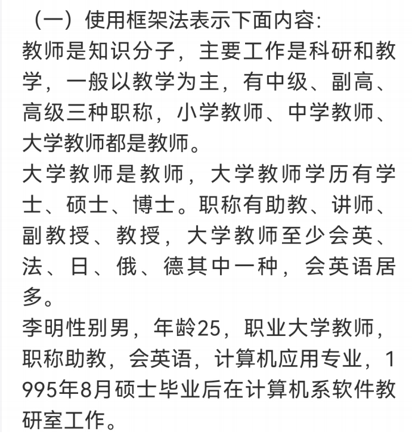
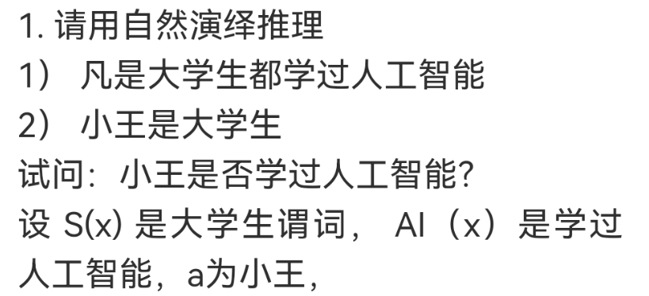
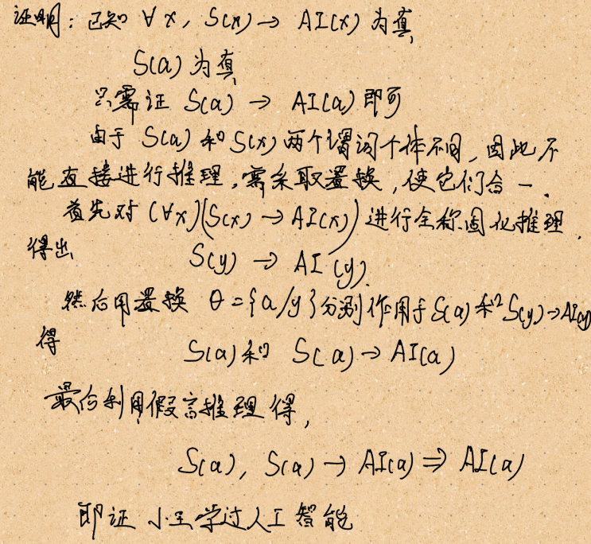
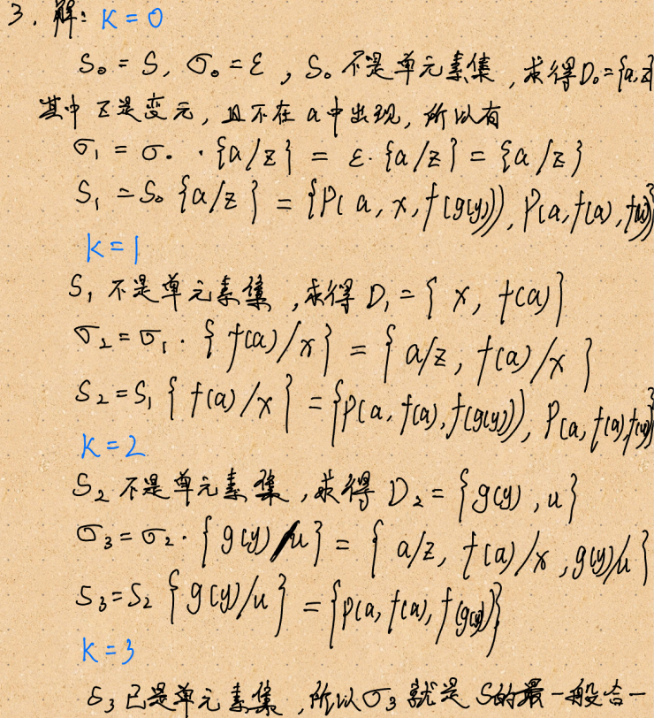
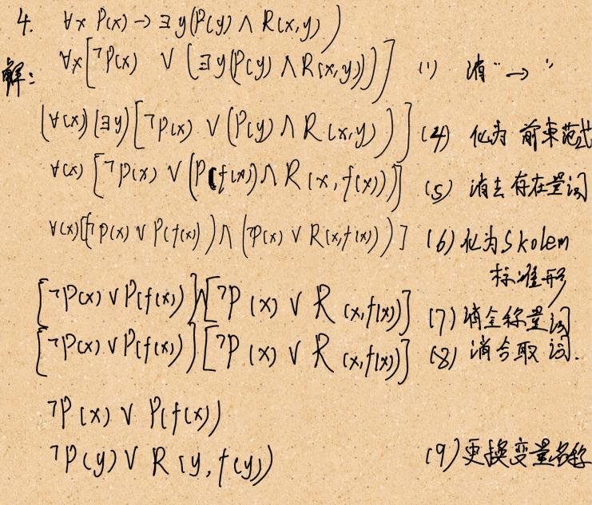
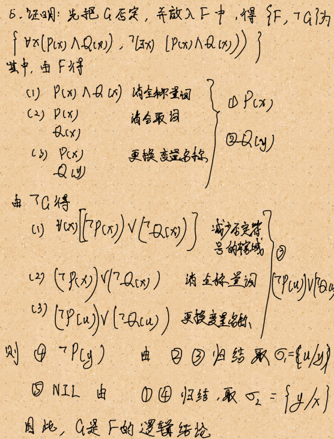

[TOC]

# 作业三

## T1 使用框架法表示下面内容

 

**解：**

Frame： <Teacher>

​	AKO：<知识分子>

​	name：Unit(Last-name, First-name)

​	Age：Unit(Year)

​			If-Needed: Ask - Age

​	Sex：Unit(male, female)

​			Dafault：male

​	Main_Job: Unit(科研， 教学)

​		Dafault: 教学

​	Professional_Qualifications：Unit(中级，副高， 高级)

​	Include：Unit(小学教师，中学教师，大学教师)

​	Major：Unit(Major)

​			If-Needed: Ask - Major

​			If-Added: Check-Major

>

Frame：<大学教师>

​	AKO：<Teacher>

​	University: Unit(Name Of the University, he or she work at.)

​			If-Needed: Ask-Name Of the University

​	Education Background：Unit(Bachelor，Master，Doctor)

​	Graduation Date： Unit(Graduation Date)	

​			If-Needed: Ask-Graduation Date

​	Level: Unit(助教，讲师，副教授，教授)

​	Foreign Language：Unit(English, French, Japanese, Russian, German)

​		Dafault: English

​		If-Needed: Ask-Foreign Language

​		If-Added: Check-Foreign Language

​	Work Lab：Unit(Work Lab)

​		If-Needed: Ask-Work Lab

​		If-Added: Check-Work Lab

>

Frame：<Teacher-1>

​	ISA: <大学教师>

​	name：Ming Li

​	Age：25

​	University: 职业大学

​	Level： 助教

​	Foreign Language：English

​	Major：计算机应用专业

​	Education Background：Master

​	Graduation Date：1995年8月

​	Work Lab：计算机系软件教研室

## T2 确定性推理

 

 

**2） 什么是置换，什么是合一？什么是最一般合一（MGU）？**

**答：**

**置换：** 是在一个谓词公式中用置换项去替换变量。

**合一：** 是寻找相对变量的置换，使两个或多个谓词公式一致。

**最一般合一：** 设σ是谓词公式集**F** 的一个合一，如果对**F**的任意一个合一θ都存在一个置换λ，使得 θ= σ· λ，则称σ是一个最一般(或最简单)合一(most general unifier，简记为mgu)。

 

 

 

 

 

 