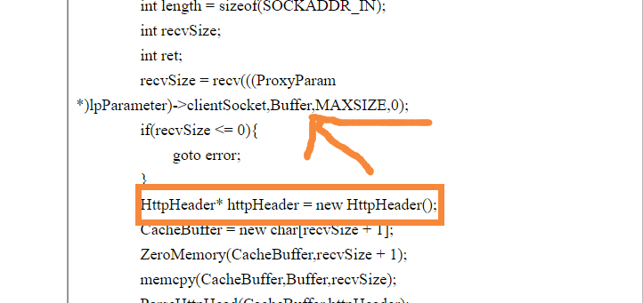
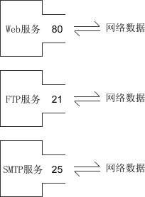
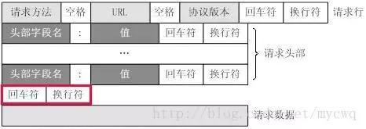
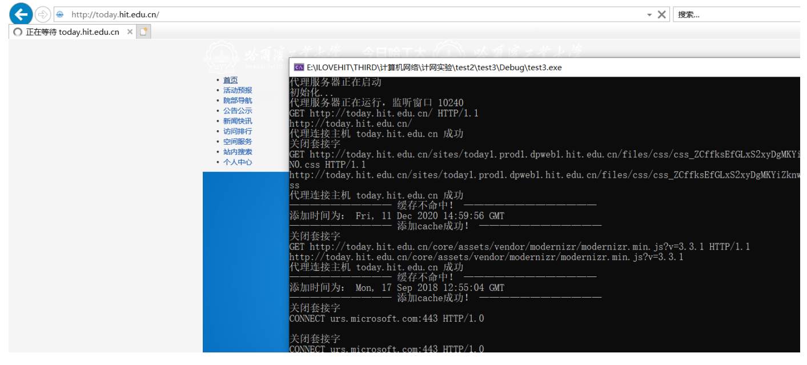
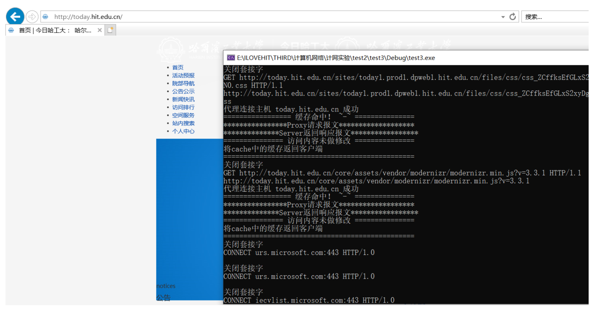
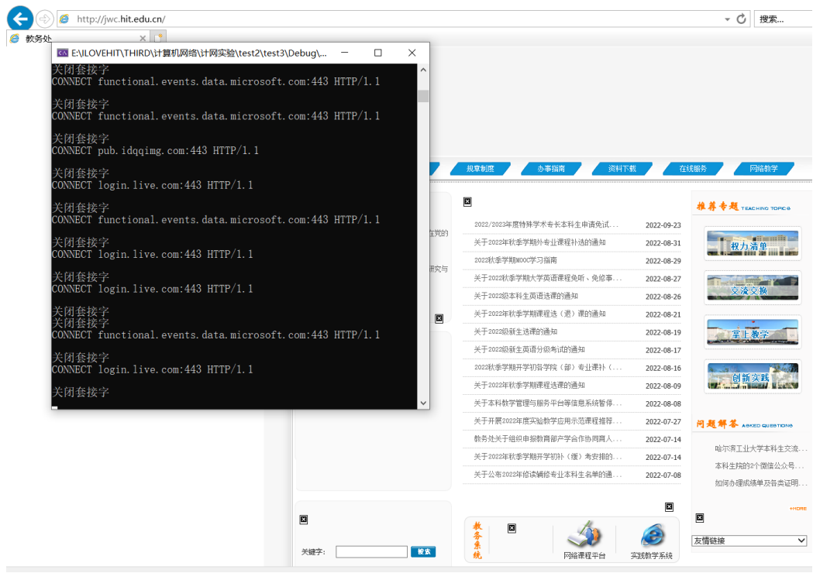
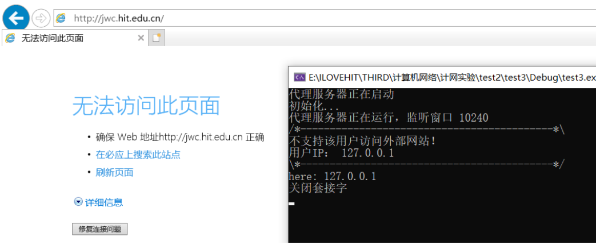
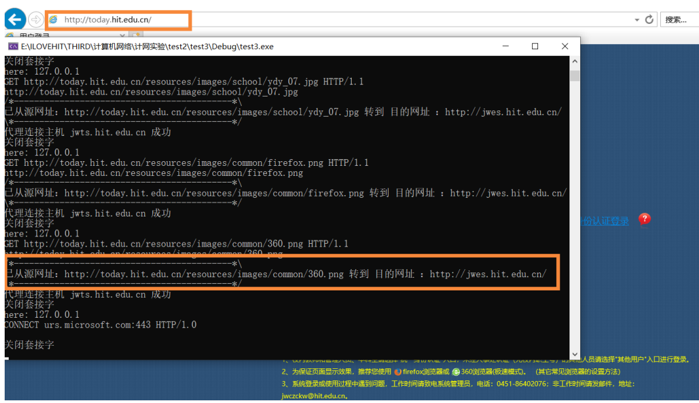

[TOC]

# 实验 1：HTTP 代理服务器的设计与实现

本人使用的VS2019来完成代码的编译运行。

## 1. 把实验书上的代码跑起来

<font color=green size=4>遇到了两个问题：</font>

### 问题一：关于`#include "stdafx.h"`

```cc
E1696	无法打开 源 文件 "stdafx.h"
C1083	无法打开包括文件: “stdafx.h”: No such file or directory	
```

`stdafx.h`是用来生成预编译头文件，这里找不到`stdafx.h`，最简单的方法就是把这个头文件注释掉，不使用预编译，将所有需要的库在文件开头`#include`一下即可。


<font color=blue>关于`stdafx.h`的介绍如下：</font>

参考Microsoft的官方文档

[预编译的头文件 | Microsoft Learn](https://learn.microsoft.com/zh-cn/cpp/build/creating-precompiled-header-files?view=msvc-170)

参考博客

[C/C++—— #include“stdafx.h”详解_konsy_dong的博客-CSDN博客_stdafx.h](https://blog.csdn.net/sinat_36053757/article/details/71265257)


实验书上的代码已经很老了，假设出书的时候用VS2008创建一个带有预编译头的文件。

1. 在Test项目中，头文件有`stdafx.h`和`targetver.h`，源文件有`stdafx.cpp`和`Test.cpp`，还有一个`ReadMe.txt`文件。

2. 默认的主函数为

   ```cpp
   #include "stdafx.h"  
   
   
   int _tmain(int argc, _TCHAR* argv[])  
   {  
       return 0;  
   }  
   ```

   但是我们平时写的主函数是

   ```c
   #include  <stdio.h>  
   
   int main()  
   {  
          return 0;  
   } 
   ```

3. 来看一下`stdafx.h`中有什么？是一些通用的头文件

   ```cpp
   // stdafx.h : 标准系统包含文件的包含文件，  
   // 或是经常使用但不常更改的  
   // 特定于项目的包含文件  
   //  
   
   #pragma once  
   
   #include "targetver.h"  
   
   #include <stdio.h>  
   #include <tchar.h>  
   
   // TODO: 在此处引用程序需要的其他头文件 
   ```

   再看看`stdafx.cpp`中有什么？

   ```cpp
   // stdafx.cpp : 只包括标准包含文件的源文件  
   // Test.pch 将作为预编译头  
   // stdafx.obj 将包含预编译类型信息  
   
   #include "stdafx.h"  
   
   // TODO: 在 STDAFX.H 中  
   // 引用任何所需的附加头文件，而不是在此文件中引用
   ```

   这里面只有包含的库文件，没有操作，它是做什么用的呢？

   在`ReadMe.txt`中，我们看到这么一段话：

   >其他标准文件：
   >`StdAfx.h`,` StdAfx.cpp`
   >这些文件用于生成名为 `Test.pch` 的预编译头 (PCH) 文件和名为 `StdAfx.obj` 的预编译类型文件。

   所以说上面的文件是用来生成编译头文件的。

4. **预编译头**的功能：

   > - [ ] 一、什么是预编译头?   
   >
   > 头文件事先编译成一种二进制的中间格式，供后续的编译过程使用。预编译头物理上与通常的的.obj文件是一样的，但是千万不要把这个中间格式与. o/.obj/.a/.lib的格式混淆，他们是截然不同的！所以预编译头文件的特性和目标文件也不同（尽管他们都属于某种中间文件）。编译入预编译头的.h,.c,.cpp文件在整个编译过程中，只编译一次，如预编译头所涉及的部分不发生改变的话，在随后的编译过程中此部分不重新进行编译。进而大大提高编译速度，并便于对头文件进行管理，也有助于杜绝重复包含问题。——但也有类似的地方的，比如，它们都是编译器之间不兼容的\^_\^，就是说你不能把VC生成的预编译头拿到GCC上去用。甚至扩展名都不一样，VC的是大家都熟悉的. pch，而GCC的，是.gch。    
   >
   > - [ ] 二、什么时候使用预编译头?    　
   >
   > - 当大多.c或.cpp文件都需要相同的头文件时。    　
   >
   > - 当某些代码被大量重复使用时。    　
   >
   > - 当导入某些不同库都有实现的函数，并产生混乱时。  


### 问题二：关于`goto`

```cpp
C2362	“goto httpHeader”跳过了“%pS”的初始化操作
```

在调用了`goto`之后还定义了随机变量，大部分编译器会认为这种行为是危险的，要将所有随机变量的定义放在调用`goto`语句之前，这样被认为是安全的。

修改方法如下



然后再运行代码可以看到如下结果


至此，实验指导用书上的代码就跑通了，下面开始写实验要求补充的内容，不过在此之前要先理解整个代码的每部分的作用，就用写注释的方法来逐行理解吧。


关于goto的补充，在后面运行代码时，需要补充新的内容，又会定义一些局部变量，`goto`还是会报错，更改了一下解决方法，自己写了一个`GoToError(LPVOID lpParameter)`函数，将`goto`的内容封装起来，在`goto`命令处调用，关闭套接字。

```cpp
//****************************************
// Method:		GoToError
// FullName:	GoToError
// Access:		public
// Returns:		void
// Qualifier:	错误处理: 网络请求过程出现问题，关闭套接字
// Parameter:	LPVOID lpParameter
//****************************************
void GoToError(LPVOID lpParameter) {
	printf("关闭套接字\n");
	Sleep(200);
	closesocket(((ProxyParam*)lpParameter)->clientSocket);
	closesocket(((ProxyParam*)lpParameter)->serverSocket);
	delete lpParameter;
	_endthreadex(0);
}
```


## 2. 理解代码

### **基础知识**

- **套接字类型**

  - [ ] **1. 流格式套接字（SOCK_STREAM）**

    流格式套接字（Stream Sockets）也叫“面向连接的套接字”，在代码中使用 SOCK_STREAM 表示。

    SOCK_STREAM 是一种可靠的、双向的通信数据流，数据可以准确无误地到达另一台计算机，如果损坏或丢失，可以重新发送。

    > **特征：**
    > 数据在传输过程中不会消失；
    > 数据是按照顺序传输的；
    > 数据的发送和接收不是同步的（有的教程也称“不存在数据边界”）

    使用了TCP协议，所以流格式套接字可以达到高质量的数据传输

  - [ ] **2.数据报格式套接字（SOCK_DGRAM）**

    数据报格式套接字（Datagram Sockets）也叫“无连接的套接字”，在代码中使用 SOCK_DGRAM 表示。

    数据报套接字是一种不可靠的、不按顺序传递的、以追求速度为目的的套接字。

    > **特征：**
    > 强调快速传输而非传输顺序；
    > 传输的数据可能丢失也可能损毁；
    > 限制每次传输的数据大小；
    > 数据的发送和接收是同步的（有的教程也称“存在数据边界”）。

    使用了UDP协议，所以传输速率很快

- ### IP，MAC，端口号

  **1.IP地址**

  - IP地址是 Internet Protocol Address 的缩写，译为“网际协议地址”。
    目前大部分软件使用 IPv4 地址，但 IPv6 也正在被人们接受
  - 一台计算机可以拥有一个独立的 IP 地址，一个局域网也可以拥有一个独立的 IP 地址，所以一个IP地址不一定能标识一台计算机
  - 在因特网上进行通信时，必须要知道对方的 IP 地址。实际上数据包中已经附带了 IP 地址，把数据包发送给路由器以后，路由器会根据 IP 地址找到对方的地里位置，完成一次数据的传递。路由器有非常高效和智能的算法，很快就会找到目标计算机。

  **2.MAC地址**

  - 一个局域网往往才能拥有一个独立的 IP，IP 地址只能定位到一个局域网，无法定位到具体的一台计算机
  - MAC 地址是 Media Access Control Address 的缩写，直译为“媒体访问控制地址”，也称为局域网地址（LAN Address），以太网地址（Ethernet Address）或物理地址（Physical Address）。
  - 真正能唯一标识一台计算机的是 MAC 地址，每个网卡的 MAC 地址在全世界都是独一无二的。计算机出厂时，MAC 地址已经被写死到网卡里面了。局域网中的路由器/交换机会记录每台计算机的 MAC 地址
  - 数据包中除了会附带对方的 IP 地址，还会附带对方的 MAC 地址，当数据包达到局域网以后，路由器/交换机会根据数据包中的 MAC 地址找到对应的计算机，然后把数据包转交给它，这样就完成了数据的传递。

  **3.端口号**

  - 有了 IP 地址和 MAC 地址，虽然可以找到目标计算机，但是一台计算机可以同时提供多种网络服务，例如 Web 服务（网站）、FTP 服务（文件传输服务）、SMTP 服务（邮箱服务）等
  - 仅有 IP 地址和 MAC 地址，计算机虽然可以正确接收到数据包，但是却不知道要将数据包交给哪个网络程序来处理，所以通信失败
  - 为了区分不同的网络程序，计算机会为每个网络程序分配一个独一无二的端口号（Port Number），例如，Web 服务的端口号是 80，FTP 服务的端口号是 21，SMTP 服务的端口号是 25。
  - 端口（Port）是一个虚拟的、逻辑上的概念。可以将端口理解为一道门，数据通过这道门流入流出，每道门有不同的编号，就是端口号。

  


### **pragma comment作用**

```cpp
#pragma comment(lib, "Ws2_32.lib") // 链接Ws2_32.lib这个库
```

```cpp
#pragma comment( comment-type [,"commentstring"] )
```

`comment-type`是一个预定义的标识符，指定注释的类型，应该是compiler，exestr，lib，linker之一。
`commentstring`是一个提供为comment-type提供附加信息的字符串，
**Remarks：**
1、compiler：放置编译器的版本或者名字到一个对象文件，该选项是被linker忽略的。
2、exestr：在以后的版本将被取消。
3、lib：放置一个库搜索记录到对象文件中，这个类型应该是和commentstring（指定你要Liner搜索的lib的名称和路径）
这个库的名字放在Object文件的默认库搜索记录的后面，linker搜索这个这个库就像你在命令行输入这个命令一样。你可以
在一个源文件中设置多个库记录，它们在object文件中的顺序和在源文件中的顺序一样。如果默认库和附加库的次序是需要
区别的，使用Z编译开关是防止默认库放到object模块。
4、linker：指定一个连接选项，这样就不用在命令行输入或者在开发环境中设置了。
只有下面的linker选项能被传给Linker.

```cpp
我们经常用到的是#pragma   comment（lib，"*.lib"）这类的。
#pragma   comment(lib,"Ws2_32.lib")表示链接Ws2_32.lib这个库。   
和在工程设置里写上链入Ws2_32.lib的效果一样，不过这种方法写的   
程序别人在使用你的代码的时候就不用再设置工程settings了
```

### **SOCKET基本函数**

#### socket()

```cpp
int socket(int af, int type, int protocol);
```

- [ ] af参数-IP 地址类型

  - **af 为地址族（Address Family），也就是 IP 地址类型，常用的有 AF_INET 和 AF_INET6。**
  - **AF_INET 表示 IPv4 地址，例如 127.0.0.1(本机地址)；AF_INET6 表示 IPv6 地址，例如 1030::C9B4:FF12:48AA:1A2B。**
  - **AF 是“Address Family”的简写，INET是“Inetnet”的简写。**
  - **你也可以使用 PF 前缀，PF 是“Protocol Family”的简写，它和 AF 是一样的。**

- [ ] type参数- 数据传输方式/套接字类型

  - **SOCK_STREAM（流格式套接字/面向连接的套接字）**
  - **SOCK_DGRAM（数据报套接字/无连接的套接字）**

- [ ] protocol参数-传输协议

  - **IPPROTO_TCP 表示 TCP 传输协议**
  - **IPPTOTO_UDP 表示 UDP 传输协议**

- [ ] **注意：** 并不是上面的type和protocol可以随意组合的，如SOCK_STREAM不可以跟IPPROTO_UDP组合。当protocol为0时，会自动选择type类型对应的默认协议。

  - **参数 af 的值为 PF_INET。如果使用 SOCK_STREAM 传输数据，那么满足这两个条件的协议只有 TCP，这种套接字称为 TCP 套接字**

    ```cpp
    int tcp_socket = socket(AF_INET, SOCK_STREAM, IPPROTO_TCP); 
    ```

  - **参数 af 的值为 PF_INET。如果使用 SOCK_DGRAM 传输方式，那么满足这两个条件的协议只有 UDP，这种套接字称为 UDP 套接字**

    ```cpp
    int udp_socket = socket(AF_INET, SOCK_DGRAM, IPPROTO_UDP);  
    ```

  - **简化写法：上面两种情况都只有一种协议满足条件，可以将 protocol 的值设为 0，系统会自动推演出应该使用什么协议**

    ```cpp
    //创建TCP套接字
    nt tcp_socket = socket(AF_INET, SOCK_STREAM, 0);  
     
    //创建UDP套接字
    int udp_socket = socket(AF_INET, SOCK_DGRAM, 0);  
    ```

    需要记住`127.0.0.1`，它是一个特殊IP地址，表示本机地址，后面会经常用到。

    当我们调用**socket**创建一个socket时，返回的socket描述字它存在于协议族（address family，AF_XXX）空间中，但没有一个具体的地址。如果想要给它赋值一个地址，就必须调用bind()函数，否则就当调用connect()、listen()时系统会自动随机分配一个端口。

#### bind()

```CPP
int bind(int sockfd, const struct sockaddr *addr, int addrlen);
```

正如上面所说bind()函数把一个地址族中的特定地址赋给socket。例如对应AF_INET、AF_INET6就是把一个ipv4或ipv6地址和端口号组合赋给socket。

函数的三个参数分别为：

- [ ] sockfd：即socket描述字，它是通过socket()函数创建了，唯一标识一个socket。bind()函数就是将给这个描述字绑定一个名字。
- [ ] addr：一个const struct sockaddr *指针，指向要绑定给sockfd的协议地址。这个地址结构根据地址创建socket时的地址协议族的不同而不同。
- [ ] addrlen：对应的是地址的长度。

下面是一个bind()函数的例子

```cpp
	struct sockaddr_in server_addr;
	int server_len = sizeof(server_addr);
	memset(&server_addr, 0, server_len);
 
	server_addr.sin_family = AF_INET;
	//server_addr.sin_addr.s_addr = inet_addr("0.0.0.0"); //用这个写法也可以
	server_addr.sin_addr.s_addr = INADDR_ANY;
	server_addr.sin_port = htons(39002);
 
	//绑定文件描述符和服务器的ip和端口号
	int m_bindfd = bind(m_sockfd, (struct sockaddr *)&server_addr, server_len);
```

通常**服务器**在启动的时候会提供一个众所周知的地址（如IP地址+端口号），用于提供服务，**客户**就可以通过它来连接服务器；而客户端就不用指定，由系统自动分配一个端口号和自身的ip地址组合。这就是为什么通常服务器端在 listen 之前会调用 bind()，而客户端不会调用 bind()，而是在 connect() 时由系统随机生成一个。

>网络字节序与主机字节序
>
>**主机字节序**就是我们平常说的大端和小端模式：不同的CPU有不同的字节序类型，这些字节序是指整数在内存中保存的顺序，这个叫做主机序。引用标准的Big-Endian和Little-Endian的定义如下：
>
>　　a) Little-Endian就是低位字节排放在内存的低地址端，高位字节排放在内存的高地址端。
>
>　　b) Big-Endian就是高位字节排放在内存的低地址端，低位字节排放在内存的高地址端。
>
>**网络字节序**：4个字节的32 bit值以下面的次序传输：首先是0～7bit，其次8～15bit，然后16～23bit，最后是24~31bit。这种传输次序称作大端字节序。 **由于TCP/IP首部中所有的二进制整数在网络中传输时都要求以这种次序，因此它又称作网络字节序。** 字节序，顾名思义字节的顺序，就是大于一个字节类型的数据在内存中的存放顺序，一个字节的数据没有顺序的问题。
>
>所以：在将一个地址绑定到socket的时候，请先将主机字节序转换成为网络字节序，而不要假定主机字节序跟网络字节序一样使用的是Big-Endian。由于这个问题曾引发过血案！公司项目代码中由于存在这个问题，导致了很多莫名其妙的问题，所以请谨记对主机字节序不要做任何假定，务必将其转化为网络字节序再赋给socket。

#### listen()

如果作为一个服务器，在调用socket()、bind()之后就会调用listen()来监听这个socket。

```cpp
int listen(int sockfd, int backlog);
```

- [ ] sockfd：要监听的socket描述字，就是上面创建的那个socket()函数的返回值。
- [ ] backlog：相应socket可以排队的最大连接个数，可以理解为有多少个客户端连接。

注意：socket()函数创建的socket默认是一个主动类型的，listen函数将socket变为被动类型的，等待客户的连接请求。

listen()如果返回 –1 ，那么说明在listen()的执行过程中发生了错误。

- **被动监听：** 是指当没有客户端请求时，套接字处于“睡眠”状态，只有当接收到客户端请求时，套接字才会被“唤醒”来响应请求。
- **请求队列：** 当套接字正在处理客户端请求时，如果有新的请求进来，套接字是没法处理的，只能把它放进缓冲区，待当前请求处理完毕后，再从缓冲区中读取出来处理。如果不断有新的请求进来，它们就按照先后顺序在缓冲区中排队，直到缓冲区满。这个缓冲区，就称为请求队列
- **缓冲区的长度（能存放多少个客户端请求）：** 可以通过 listen() 函数的 backlog 参数指定，但究竟为多少并没有什么标准，可以根据你的需求来定，并发量小的话可以是10或者20。如果将 backlog 的值设置为 SOMAXCONN，就由系统来决定请求队列长度，这个值一般比较大，可能是几百，或者更多。不过这里实验用书中的SOMAXCONN是5，可能是出书的年代太久远了，硬件还没那么给力。
- **请求队列满时：** 不再接收新的请求，对于 Linux，客户端会收到 ECONNREFUSED 错误，对于 Windows，客户端会收到 WSAECONNREFUSED 错误。
- **listen() 只是让套接字处于监听状态，并没有接收请求。接收请求需要使用 accept() 函数。**


#### connect()函数

客户端通过调用connect函数来建立与TCP服务器的连接，connect()函数结构如下

```cpp
int connect(int sockfd, const struct sockaddr *addr, socklen_t addrlen);
```

- [ ] sockfd：客户端的socket描述字，就是上面客户端创建的socket()函数的返回值，一般都是大于0的
- [ ] addr：服务器的socket地址，是一个存储远程计算机的IP地址和端口信息的结构，一般为服务器的ip与port
- [ ] addrlen：socket地址的长度，这里addrlen=sizeof(addr)。

<font color=red>注意：这里的远程服务端的端口一定要设置好，千万不要设置了被服务器防火墙拦截的端口。否则，由于设置的端口被服务器防火墙给拦截了，将一直无法连接。切记切记！！！</font>

#### accept()函数

TCP服务器端依次调用socket()、bind()、listen()之后，就会监听指定的socket地址了。TCP客户端依次调用socket()、connect()之后就想TCP服务器发送了一个连接请求。TCP服务器监听到这个请求之后，就会调用accept()函数取接收请求，这样连接就建立好了。之后就可以开始网络I/O操作了，即类同于普通文件的读写I/O操作。

```cpp
int accept(int sockfd, struct sockaddr *addr, socklen_t *addrlen);
```

- [ ] 服务器的socket描述字
- [ ] 指向struct sockaddr *的指针，用于返回客户端的协议地址
- [ ] 协议地址的长度，要注意这个长度的类型是socklen_t，不可写成int

如果accpet成功，那么其返回值是由内核自动生成的一个全新的描述字，代表与返回客户的TCP连接。

```cpp
//定义客户端的套接字，这里返回一个新的套接字，后面通信时，就用这个m_connfd进行通信
struct sockaddr_in client_addr;
socklen_t client_len = sizeof(client_addr);
int m_connfd = accept(m_sockfd, (struct sockaddr *)&client_addr, &client_len);
```

**注意：** accept的第一个参数为服务器的socket描述字，是服务器开始调用socket()函数生成的，称为监听socket描述字；而accept函数返回的是已连接的socket描述字。一个服务器通常通常仅仅只创建一个监听socket描述字，它在该服务器的生命周期内一直存在。内核为每个由服务器进程接受的客户连接创建了一个已连接socket描述字，当服务器完成了对某个客户的服务，相应的已连接socket描述字就被关闭。

**listen() 只是让套接字进入监听状态，并没有真正接收客户端请求，listen() 后面的代码会继续执行，直到遇到 accept()。accept() 会阻塞程序执行（后面代码不能被执行），直到有新的请求到来**


#### read()、write()等函数

到了这里，服务器与客户已经建立好连接了。建立连接之后，我们通过客户端发送数据给服务端，当然也可以服务端发过来。因为TCP连接是全双工的。用以下函数可以实现网络中不同进程之间的通信！网络I/O操作有下面几组：

```cpp
read()/write()
recv()/send()
readv()/writev()
recvmsg()/sendmsg()
recvfrom()/sendto()
```

常用的是`read()/write()`和`recv()/send()`这两组函数

```cpp
#include <unistd.h>
 
ssize_t read(int fd, void *buf, size_t count);
ssize_t write(int fd, const void *buf, size_t count);
 
#include <sys/types.h>
#include <sys/socket.h>
 
ssize_t send(int sockfd, const void *buf, size_t len, int flags);
ssize_t recv(int sockfd, void *buf, size_t len, int flags);
 
ssize_t sendto(int sockfd, const void *buf, size_t len, int flags,
			  const struct sockaddr *dest_addr, socklen_t addrlen);
ssize_t recvfrom(int sockfd, void *buf, size_t len, int flags,
				struct sockaddr *src_addr, socklen_t *addrlen);
 
ssize_t sendmsg(int sockfd, const struct msghdr *msg, int flags);
ssize_t recvmsg(int sockfd, struct msghdr *msg, int flags);
```

> **read函数**是负责从fd中读取内容。
>
> - 当读成功时，read返回实际所读的字节数。
>   - 如果返回的值是0表示已经读到文件的结束了
>   - 小于0表示出现了错误。
>     - 如果错误为EINTR说明读是由中断引起的
>     - 如果是ECONNREST表示网络连接出了问题。
>
> **write函数**将buf中的nbytes字节内容写入文件描述符fd。
>
> - 成功时返回写的字节数，失败时返回-1，并设置errno变量。 在网络程序中，当我们向套接字文件描述符写时有两种可能。
>
>   - 1) write的返回值大于0，表示写了部分或者是全部的数据
>
>   - 2) 返回的值小于0，此时出现了错误。
>
>     - 我们要根据错误类型来处理。如果错误为EINTR表示在写的时候出现了中断错误。
>     - 如果为EPIPE表示网络连接出现了问题(对方已经关闭了连接)。


#### close()函数

在服务器与客户端建立连接之后，会进行一些读写操作，完成了读写操作就要关闭相应的socket描述字，好比操作完打开的文件要调用fclose关闭打开的文件。

```cpp
int close(int fd);
```

该函数的参数就是上面创建的socket的返回值，该描述字不能再由调用进程使用，也就是说不能再作为read或write的第一个参数。至此，socket就会关闭，连接断掉，不能在进行通信了。我们熟知的http协议，每次请求之后都会断开，就是调用了这个close()函数的原因。

**注意：** close操作只是使相应socket描述字的引用计数-1，只有当引用计数为0的时候，才会触发TCP客户端向服务器发送终止连接请求。


### **基本参数总述**

```cpp
// 代理相关参数
SOCKET ProxyServer;
sockaddr_in ProxyServerAddr;
const int ProxyPort = 10240;
```


```cpp
// 代理相关参数
/***** 参数 *********************************************/
SOCKET ProxyServer; // 代理服务器的SOCKET
			/* 解释 */
typedef UINT_PTR        SOCKET;
typedef _W64 unsigned int UINT_PTR, *PUINT_PTR;


/***** 参数 *********************************************/
sockaddr_in ProxyServerAddr; // 创建代理服务器的地址结构体
			/* 解释 */
/*
 * Socket address, internet style.
 */
struct sockaddr_in {
        short   sin_family;
        u_short sin_port;
        struct  in_addr sin_addr;
        char    sin_zero[8];
};
//
// IPv4 Internet address
// This is an 'on-wire' format structure.
//
typedef struct in_addr {
        union {
                struct { UCHAR s_b1,s_b2,s_b3,s_b4; } S_un_b;
                struct { USHORT s_w1,s_w2; } S_un_w;
                ULONG S_addr;
        } S_un;
#define s_addr  S_un.S_addr /* can be used for most tcp & ip code */
#define s_host  S_un.S_un_b.s_b2    // host on imp
#define s_net   S_un.S_un_b.s_b1    // network
#define s_imp   S_un.S_un_w.s_w2    // imp
#define s_impno S_un.S_un_b.s_b4    // imp #
#define s_lh    S_un.S_un_b.s_b3    // logical host
} IN_ADDR, *PIN_ADDR, FAR *LPIN_ADDR;

/***** 参数 *********************************************/
const int ProxyPort = 10240; // 代理服务器在端口 10240 接收来自客户的请求
```

### **函数详解**

- **函数功能总述**

```cpp
//****************************************
// Method:		InitSocket
// FullName:	InitSocket
// Access:		public
// Returns:		BOOL
// Qualifier:	初始化套接字 
//****************************************
BOOL InitSocket();

//****************************************
// Method:		ParseHttpHead
// FullName:	ParseHttpHead
// Access:		public
// Returns:		void
// Qualifier:	解析 TCP 报文中的 HTTP 头部
// Parameter:	char *buffer
// Parameter:	HttpHeader *httpHeader 
//****************************************
void ParseHttpHead(char* buffer, HttpHeader* httpHeader);

//****************************************
// Method:		ConnectToServer
// FullName:	ConnectToServer
// Access:		public
// Returns:		BOOL
// Qualifier:	根据主机创建目标服务器套接字，并连接
// Parameter:	SOCKET * serverSocket
// Parameter:	char * host
//****************************************
BOOL ConnectToServer(SOCKET* serverSocket, char* host);

//****************************************
// Method:		ProxyThread
// FullName:	ProxyThread
// Access:		public
// Returns:		unsigned int __stdcall
// Qualifier:	线程执行函数
// Parameter:	LPVOID lpParameter 
//****************************************
unsigned int __stdcall ProxyThread(LPVOID lpParameter);
```

- **主函数**

```cpp
int _tmain(int argc, _TCHAR* argv[]) {
	printf("代理服务器正在启动\n");
	printf("初始化...\n");
	/* 初始化代理服务器 */
	if (!InitSocket()) {
		printf("socket 初始化失败\n");
		return -1;
	}
	printf("代理服务器正在运行，监听窗口 %d\n", ProxyPort);
	SOCKET acceptSocket = INVALID_SOCKET; // 初始化服务器为没有接收到请求的状态
	ProxyParam* lpProxyParam; // 定义一个结构体指针，指向客户创建的socket和服务器创建的socket
	HANDLE hThread; // 创建一个空的函数句柄(void *)
	DWORD dwThreadID; // 创建一个常量用来记录线程的ID

	// 代理服务器不断监听
	while (true) {
		acceptSocket = accept(ProxyServer, NULL, NULL); // 代理服务器监听是否有客户端的代理请求
		lpProxyParam = new ProxyParam; // 给结构体指针分配空间来存储客户和代理服务器创建的socket信息
		if (lpProxyParam == NULL) { // 空间分配失败，丢弃本次请求
			continue;
		}
		// 空间分配成功
		lpProxyParam->clientSocket = acceptSocket; // 记录客户创建新的socket
		hThread = (HANDLE)_beginthreadex(NULL, 0, &ProxyThread, (LPVOID)lpProxyParam, 0, 0); // 代理服务器为该客户的代理请求创建一个线程来执行请求
		CloseHandle(hThread); // 请求执行完毕，收回该线程
		Sleep(200); // 间隔20ms再次监听
	}
	closesocket(ProxyServer); // 停止代理服务，结束监听模式后，关闭代理服务器的socket
	WSACleanup(); // 解除与socket库(Ws2_32.dll)的绑定并且释放socket库所占用的系统资源	
	return 0;
}
```

- **初始化套接字函数**

```cpp
//****************************************
// Method:		InitSocket
// FullName:	InitSocket
// Access:		public
// Returns:		BOOL
// Qualifier:	初始化套接字 
//****************************************
BOOL InitSocket() {
	// 加载套接字库（必须）
	WORD wVersionRequested; //win sockets规范版本，为WORD类型
	WSADATA wsaData; // 用于存储调用WSAStartup()函数后返回的win socket数据
	// 套接字加载时错误提示
	int err;
	// 版本 2.2
	wVersionRequested = MAKEWORD(2, 2); // 高位字节中存储副版本号，低位字节存储主版本号
	// 加载 dll 文件 Socket 库
	err = WSAStartup(wVersionRequested, &wsaData); // 初始化win sock，当返回值为0时，初始化成功
	if (err != 0) { // 初始化win sock失败，打印错误代码以提示
		// 找不到 winsock.dll
		printf("加载 winsock 失败，错误代码为：%d\n", WSAGetLastError());
		return false;
	}
	if (LOBYTE(wsaData.wVersion) != 2 || HIBYTE(wsaData.wVersion) != 2) {
		printf("不能找到正确的 winsock 版本\n");
		WSACleanup();
		return FALSE;
	}
	ProxyServer = socket(AF_INET, SOCK_STREAM, 0); // 创建代理服务器套接字
	if (INVALID_SOCKET == ProxyServer) { // 如果代理服务器套接字还是初始状态，代表创建套接字失败
		printf("创建套接字失败，错误代码为：%d\n", WSAGetLastError());
		return FALSE;
	}
	ProxyServerAddr.sin_family = AF_INET; // 表示套接字使用TCP/IP协议族
	// htonl()函数的意思是将主机顺序的字节转换成网络顺序的字节（避免大小端编码方式不一致导致的错误一致）
	ProxyServerAddr.sin_port = htons(ProxyPort); // 设置通信端口号，ProxyPort是我们已经定义好的10240
    // 设置服务器套接字的IP地址为特殊值INADDR_ANY，这表示服务器愿意接收来自任何网络设备接口的客户机连接
	ProxyServerAddr.sin_addr.S_un.S_addr = INADDR_ANY; 
    // 将服务器创建的套接字标识和服务端口地址绑定
	if (bind(ProxyServer, (SOCKADDR*)&ProxyServerAddr, sizeof(SOCKADDR)) == SOCKET_ERROR) { 
		printf("绑定套接字失败，错误代码为：%d\n", WSAGetLastError());
		return FALSE;
	}
	if (listen(ProxyServer, SOMAXCONN) == SOCKET_ERROR) { // 等待用户连接请求
		printf("监听端口%d失败", ProxyPort);
		return FALSE;
	}
	return TRUE;
}
```

- **ConnectToServer 根据主机创建目标服务器套接字，并连接**

  - 函数补充说明

    ```cpp
    gethostbyname()函数说明——用域名或主机名获取IP地址，这个函数仅仅支持IPv4。
    
        包含头文件
        #include <netdb.h>
        #include <sys/socket.h>
        函数原型
        struct hostent *gethostbyname(const char *name);
        这个函数的传入值是域名或者主机名，例如"www.google.cn"等等。传出值，是一个hostent的结构。如果函数调用失败，将返回NULL。
    
        返回hostent结构体类型指针
        struct hostent
        {
            char    *h_name;               
            char    **h_aliases;
            int     h_addrtype;
            int     h_length;
            char    **h_addr_list;
            #define h_addr h_addr_list[0]
        };
    
        hostent->h_name
        表示的是主机的规范名。例如www.google.com的规范名其实是www.l.google.com。
        hostent->h_aliases
        表示的是主机的别名.www.google.com就是google他自己的别名。有的时候，有的主机可能有好几个别名，这些，其实都是为了易于用户记忆而为自己的网站多取的名字。
        hostent->h_addrtype    
        表示的是主机ip地址的类型，到底是ipv4(AF_INET)，还是pv6(AF_INET6)
        hostent->h_length      
        表示的是主机ip地址的长度
        hostent->h_addr_lisst
        表示的是主机的ip地址，注意，这个是以网络字节序存储的。千万不要直接用printf带%s参数来打这个东西，会有问题的哇。所以到真正需要打印出这个IP的话，需要调用inet_ntop()。
        const char *inet_ntop(int af, const void *src, char *dst, socklen_t cnt) ：
        这个函数，是将类型为af的网络地址结构src，转换成主机序的字符串形式，存放在长度为cnt的字符串中。返回指向dst的一个指针。如果函数调用错误，返回值是NULL。
        inet_addr() 将一个ip地址字符串转换成一个整数值
    ```

    

```cpp
//****************************************
// Method:		ConnectToServer
// FullName:	ConnectToServer
// Access:		public
// Returns:		BOOL
// Qualifier:	根据主机创建目标服务器套接字，并连接
// Parameter:	SOCKET * serverSocket
// Parameter:	char * host 
//****************************************
BOOL ConnectToServer(SOCKET* serverSocket, char* host) { // 传入目标服务器套接字，和主机ip
	sockaddr_in serverAddr;
	serverAddr.sin_family = AF_INET; // 目的服务器地址类型为 IPv4
	serverAddr.sin_port = htons(HTTP_PORT); // 要访问的端口是 80
	//  gethostbyname：用域名或主机名获取IP地址，这个函数仅仅支持IPv4
	HOSTENT* hostent = gethostbyname(host); // 返回hostent结构体类型指针，包含本地主机的各种信息
	if (!hostent) { // 获取本地主机信息失败
		return FALSE;
	}
	in_addr Inaddr = *((in_addr*)*hostent->h_addr_list); // 是主机的ip地址，注意，这个是以网络字节序存储的
	serverAddr.sin_addr.s_addr = inet_addr(inet_ntoa(Inaddr)); // inet_ntop()将Inaddr转换成主机序的字符串形式，inet_addr()将一个ip地址字符串转换成一个整数值
	*serverSocket = socket(AF_INET, SOCK_STREAM, 0); // 创建一个流格式套接字（默认为TCP协议），给目标服务器套接字
	if (*serverSocket == INVALID_SOCKET) { // 套接字创建失败
		return FALSE;
	}
	if (connect(*serverSocket, (SOCKADDR*)&serverAddr, sizeof(serverAddr)) == SOCKET_ERROR) { // 建立主机与目标服务器之间的连接
		closesocket(*serverSocket); // 如果创建失败则销毁创建的目标服务器套接字
		return FALSE;
	}
	return TRUE;
}
```

- **ParseHttpHead 解析 TCP 报文中的 HTTP 头部**

  - 函数补充说明

    - **1、strtok函数**

      函数原型：`char * strtok (char *str, const char * delimiters);`

      参数：str，待分割的字符串（c-string）；delimiters，分割符字符串。

      该函数用来将字符串分割成一个个片段。参数str指向欲分割的字符串，参数delimiters则为分割字符串中包含的所有字符。当strtok()在参数s的字符串中发现参数delimiters中包涵的分割字符时，则会将该字符改为\0 字符。

      在第一次调用时，strtok()必需给予参数s字符串，往后的调用则将参数s设置成NULL。每次调用成功则返回指向被分割出片段的指针。

      需要注意的是，使用该函数进行字符串分割时，会破坏被分解字符串的完整，调用前和调用后的s已经不一样了。第一次分割之后，原字符串str是分割完成之后的第一个字符串，剩余的字符串存储在一个静态变量中，因此多线程同时访问该静态变量时，则会出现错误。

      strtok()使用举例

    ```cpp
    #include <stdio.h>
    #include <stdlib.h>
    #include <string.h>
     
    int main()
    {
        char str[]="ab,cd,ef";
        char *ptr;
        printf("before strtok:  str=%s\n",str);
        printf("begin:\n");
        ptr = strtok(str, ",");
        while(ptr != NULL){
            printf("str=%s\n",str);
            printf("ptr=%s\n",ptr);
            ptr = strtok(NULL, ",");
        }
        system("pause");
        return 0;
    }
    ```

    ​	输出结果如下

    ```shell
    before strtok:  str=ab,cd,ef
    begin:
    str=ab
    ptr=ab
    str=ab
    ptr=cd
    str=ab
    ptr=ef
    ```

    - **2、strtok_s函数**

      strtok_s是windows下的一个分割字符串安全函数

      函数原型：`strtok_s(char *_String, const char *_Delimiter, char **_Context)`

      这个函数将剩余的字符串存储在_Context变量中，而不是静态变量中，从而保证了安全性。

    - **3、strtok_r函数**

      strtok_r函数是linux下分割字符串的安全函数
      函数原型：`char *strtok_r(char *str, const char *delim, char **saveptr);`
      该函数也会破坏带分解字符串的完整性，但是其将剩余的字符串保存在`saveptr`变量中，保证了安全性。

      使用举例

      ```cpp
      #include <stdio.h>
      #include <stdlib.h>
      #include <string.h>
       
      int main()
      {
          char str[]="ab,cd,ef";
          char *ptr;
          char *p;
          printf("before strtok:  str=%s\n",str);
          printf("begin:\n");
          ptr = strtok_r(str, ",", &p);
          while(ptr != NULL){
              printf("str=%s\n",str);
              printf("ptr=%s\n",ptr);
              ptr = strtok_r(NULL, ",", &p);
          }
          return 0;
      }
      ```

      运行结果如下

      ```shell
      before strtok:  str=ab,cd,ef
      begin:
      str=ab
      ptr=ab
      str=ab
      ptr=cd
      str=ab
      ptr=ef
      ```

  - URL

    Internet上的每一个网页都具有一个唯一的名称标识，通常称之为URL（Uniform Resource Locator, 统一资源定位器）。它是www的统一资源定位标志，简单地说URL就是web地址，俗称“网址”。

    URL由三部分组成：资源类型、存放资源的主机域名、资源文件名。

    URL的一般语法格式为：

    `protocol :// hostname[:port] / path / [;parameters][?query]#fragment`

    **格式说明:**

    - protocol（协议）
      指定使用的传输协议，最常用的HTTP协议，它是目前WWW中应用最广的协议。

      下面列出protocol属性常见的名称：

      ```html
      http 通过 HTTP 访问该资源。 格式 HTTP://
      https 通过安全的 HTTPS 访问该资源。 格式 HTTPS://
      ftp 通过 FTP访问资源。格式 FTP://
      ```

      一般来说，https开头的URL要比http开头的更安全，因为这样的URL传输信息是采用了加密技术。

    - hostname（主机名）

      是指存放资源的服务器的域名系统(DNS) 主机名或 IP 地址。有时，在主机名前也可以包含连接到服务器所需的用户名和密码（格式：username:password@hostname）

    - port（端口号）

      HTTP省略时，工作在TCP协议80端口，用户访问网站http:// 打头的都是标准HTTP服务

      HTTPS缺省工作在TCP协议443端口

    - path（路径）

      由零或多个“/”符号隔开的字符串，一般用来表示主机上的一个目录或文件地址。

    - parameters（参数）

      这是用于指定特殊参数的可选项。

      - [ ] **query(查询)：** 可选，用于给动态网页（如使用CGI、ISAPI、PHP/JSP/ASP/ASP。NET等技术制作的网页）传递参数，可有多个参数，用“&”符号隔开，每个参数的名和值用“=”符号隔开。
      - [ ] **fragment（信息片断）：** 信息片断，字符串，用于指定网络资源中的片断。例如一个网页中有多个名词解释，可使用fragment直接定位到某一名词解释。

  - 请求命令

    - **GET** 请求是最常见的请求类型，最常用于向服务器查询某些信息

    - **POST** 通常用于向服务器发送应该被保存的数据

    - **GET请求和POST请求的区别**
      这两种请求都是将数据传送到服务器，他们的区别在于：

      GET在浏览器回退时是无害的，而POST会再次提交请求
      GET产生的URL地址可以被Bookmark，而POST不可以
      GET请求会被浏览器主动cache，而POST不会，除非手动设置
      GET请求只能进行url编码，而POST支持多种编码方式
      GET请求参数会被完整保留在浏览器历史记录里，而POST中的参数不会被保留
      GET请求在URL中传送的参数是有长度限制的，而POST没有
      对参数的数据类型，GET只接受ASCII字符，而POST没有限制
      GET参数通过URL传递，POST放在Request body中
      GET比POST更不安全，因为参数直接暴露在URL上，所以不能用来传递敏感信息

  - **HTTP请求报文的一般格式** 由4部分组成：请求行、请求头部、空行、请求数据。如下图所示：

    

  ```cpp
  //****************************************
  // Method:		ParseHttpHead
  // FullName:	ParseHttpHead
  // Access:		public
  // Returns:		void
  // Qualifier:	解析 TCP 报文中的 HTTP 头部
  // Parameter:	char *buffer
  // Parameter:	HttpHeader *httpHeader 
  //****************************************
  void ParseHttpHead(char* buffer, HttpHeader* httpHeader) { // 传入一个缓存数组，HTTP头部结构体指针
  	char* p; // 指向分割后的第一个字符串
  	char* ptr; // 存储分割后剩下部分的内容
  	const char* delim = "\r\n"; // 利用CLF格式下的换行符作为分割符
  	p = strtok_s(buffer, delim, &ptr); // 提取第一行，将buffer中的所有 delim 换成 '/0'。
  	printf("%s\n", p); // 打印分割出的第一个字符串
  	if (p[0] == 'G') { // GET 方式 
  		memcpy(httpHeader->method, "GET", 3); // 在HTTP头部加入 GET 操作请求
  		memcpy(httpHeader->url, &p[4], strlen(p) - 13); // 在HTTP头部加入目标服务器 url 网址
  	}
  	else if (p[0] == 'P') { // POST 方法 
  		memcpy(httpHeader->method, "POST", 4); // 在HTTP头部加入 POST 操作请求
  		memcpy(httpHeader->url, &p[5], strlen(p) - 14);
  	}
  	printf("%s\n", httpHeader->url); // 打印请求访问的 url
  	p = strtok_s(NULL, delim, &ptr); // 将指针 p 指向下一个分割出的字符串的首地址
  	while (p) { // 遍历报文buffer中分割出的剩余的字符串，将命令解析后放入 HTTP 头部
  		switch (p[0]) {
  		case 'H': // Host
  			memcpy(httpHeader->host, &p[6], strlen(p) - 6); // 取出host相关内容放入头部
  			break;
  		case 'C': // Cookie
  			if (strlen(p) > 8) { 
  				char header[8];
  				ZeroMemory(header, sizeof(header));
  				memcpy(header, p, 6);
  				if (!strcmp(header, "Cookie")) { // 如果头部字段名匹配成功，则将 cookie 的内容加载到头部
  					memcpy(httpHeader->cookie, &p[8], strlen(p) - 8);
  				}
  			}
  			break;
  		default:
  			break;
  		}
  		p = strtok_s(NULL, delim, &ptr); // 指针再次移动到下一个分割出的字符串的首地址
  	}
  }
  ```

- **ProxyThread 线程执行函数**

  ```cpp
  //****************************************
  // Method:		ProxyThread
  // FullName:	ProxyThread
  // Access:		public
  // Returns:		unsigned int __stdcall
  // Qualifier:	线程执行函数
  // Parameter:	LPVOID lpParameter 
  //****************************************
  unsigned int __stdcall ProxyThread(LPVOID lpParameter) {
  	char Buffer[MAXSIZE];
  	char* CacheBuffer;
  	ZeroMemory(Buffer, MAXSIZE);
  	SOCKADDR_IN clientAddr;
  	int length = sizeof(SOCKADDR_IN);
  	int recvSize;
  	int ret;
  	recvSize = recv(((ProxyParam*)lpParameter)->clientSocket, Buffer, MAXSIZE, 0); // 代理服务器的线程接收客户端的请求报文，将报文存储在 Buffer 中
  	HttpHeader* httpHeader = new HttpHeader(); // 创建一个 HTTP 头部
  	if (recvSize <= 0) {
  		goto error;
  	}
  	CacheBuffer = new char[recvSize + 1];
  	ZeroMemory(CacheBuffer, recvSize + 1);
  	memcpy(CacheBuffer, Buffer, recvSize); // 代理服务器将请求报文存储在 CacheBuffer 中
  	ParseHttpHead(CacheBuffer, httpHeader); // 代理服务器解析客户端的 TCP 请求报文内容，加入 HTTP 头部
  	delete CacheBuffer; // 删除临时报文的缓存
  	if (!ConnectToServer(&((ProxyParam*)lpParameter)->serverSocket, httpHeader->host)) { // 代理服务器代替客户端和目标服务器建立连接
  		goto error;
  	}
  	printf("代理连接主机 %s 成功\n", httpHeader->host);
  	// 将客户端发送的 HTTP 数据报文直接转发给目标服务器
  	ret = send(((ProxyParam*)lpParameter)->serverSocket, Buffer, strlen(Buffer) + 1, 0);
  	// 等待目标服务器返回数据
  	recvSize = recv(((ProxyParam*)lpParameter)->serverSocket, Buffer, MAXSIZE, 0);
  	if (recvSize <= 0) {
  		goto error;
  	}
  	// 将目标服务器返回的数据直接转发给客户端
  	ret = send(((ProxyParam*)lpParameter)->clientSocket, Buffer, sizeof(Buffer), 0);
  
  	// 错误处理 
  error:
  	printf("关闭套接字\n");
  	Sleep(200);
  	closesocket(((ProxyParam*)lpParameter)->clientSocket);
  	closesocket(((ProxyParam*)lpParameter)->serverSocket);
  	delete lpParameter;
  	_endthreadex(0);
  	return 0;
  }
  ```

  

## 3. 完成实验任务

基本理解了实验书上的代码之后，现在来实现实验要求的内容。

**实验内容：**

### 必做内容

> **设计并实现一个基本 HTTP 代理服务器。要求在指定端口（例如**
> **8080）接收来自客户的 HTTP 请求并且根据其中的 URL 地址访问该地址所**
> **指向的 HTTP 服务器（原服务器），接收 HTTP 服务器的响应报文，并将响**
> **应报文转发给对应的客户进行浏览。**
>
> - 查看设置，确认走代理

上面的代码已经实现了该功能。


### 选做 1：设计并实现一个支持 Cache 功能的 HTTP 代理服务器

> 选做 1：**设计并实现一个支持 Cache 功能的 HTTP 代理服务器。要求能缓存**
> **原服务器响应的对象， 并能够通过修改请求报文（添加 if-modified-since 头**
> **行），向原服务器确认缓存对象是否是最新版本。**
>
> - 缓存前无文件，缓存后有文件
> - 打开缓存内容：if-modified-since
> - 程序输出是否命中（命中处加断点）


- [ ] **状态码首位含义：**

| 状态码 | 说明       |
| ------ | ---------- |
| 1xx    | 消息       |
| 2xx    | 成功       |
| 3xx    | 重定向     |
| 4xx    | 客户端错误 |
| 5xx    | 服务器错误 |

- [ ] **常用状态码：**

| 状态码 | 说明                                                       |
| ------ | ---------------------------------------------------------- |
| 200    | 执行成功                                                   |
| 302    | 它和307一样，都是用于重定向的状态码。只是307目前已不再使用 |
| 304    | 请求资源未改变，使用缓存。                                 |
| 400    | 请求错误。最常见的就是请求参数有问题                       |
| 404    | 请求资源未找到                                             |
| 405    | 请求方式不被支持                                           |
| 500    | 服务器运行内部错误                                         |


可以看到目标服务器返回的响应报文中有`Last-Modified: `字段来提示网页的最后修改时间，我们据此来判断网页是否有更新

<font color=green size=4>实现思路如下：</font>

> 1. 创建一个cache数组存储用户访问过的服务器响应的数据
> 2. 用户第一次访问某个服务器中的数据时，代理服务器将目标无服务器返回的报文内容缓存下来，保存到本地（结构体数组中）。
> 3. 如果用户的访问在cache数组中查到了响应的缓存，再向服务器请求HTTP报文，根据目标服务器响应报文的`Last-Modified: `字段与proxyserver缓存中的`if-modified-since`字段做比较，判断代理服务器缓存内容是否是最新的，如果是，则直接将缓存返回给客户端；否则将服务器的响应转发给客户端，并更新代理服务器的缓存。

效果演示如下：

*   第一次访问，缓存未命中

    

*   第二次访问，缓存命中

    

### 选做 2：扩展 HTTP 代理服务器

>选做 2：**扩展 HTTP 代理服务器，支持如下功能：**
>
>1. **网站过滤：允许/不允许访问某些网站；**
>
>- 检查过滤的网站
>- 开启后无法访问当前网站，对其他网站可以访问
>
>2. **用户过滤：支持/不支持某些用户访问外部网站**
>
>- 检查过滤的用户(一般是 127.0.0.1)
>- 过滤用户无法访问网站
>
>3. **网站引导：将用户对某个网站的访问引导至一个模拟网站（钓鱼）**

- [x] **网站过滤：允许/不允许访问某些网站；**

在代理服务器与目的服务器创建连接前，判断HTTP头部 url ，即要访问的网址是否在禁用名单中。

```cpp
//****************************************
// Method:		ForbidInvalidWebsite
// FullName:	ForbidInvalidWebsite
// Access:		public
// Returns:		BOOL
// Qualifier:	判断要访问的网站是不是被禁用的网站
// Parameter:	HttpHeader * httpHeader
//****************************************
BOOL ForbidInvalidWebsite(HttpHeader* httpHeader) {
	for (int i = 0; i < invalid_website_num; ++i) {
		// 如果是禁用的网站，返回true
		if (!strcmp(httpHeader->url, invalid_website[i])) {
			printf("/*-------------------------------------------*\\\n");
			printf("网站已禁用！\n");
			printf("网址： %s\n", invalid_website[i]);
			printf("\\*-------------------------------------------*/\n");
			return true;
		}
	}
	return false; // 如果都没匹配上，说明不是被禁用的网站
}
```

测试结果如下

- 开启后无法访问当前网站


- 对其他网站可以访问



- [x]  **用户过滤：支持/不支持某些用户访问外部网站**

```cpp
// 注意对下面这句命令的补充，取到正确的客户端IP地址，否则获取的ip地址将不是指定的本地ip地址
acceptSocket = accept(ProxyServer, (SOCKADDR*)&acceptAddr, &(addr_len));
```

```
//****************************************
// Method:		ForbidInvalidUser
// FullName:	ForbidInvalidUser
// Access:		public
// Returns:		bool true说明已屏蔽该用户
// Qualifier:	判断发送请求的是不是被禁用的用户
// Parameter:	char* userIP
//****************************************
BOOL ForbidInvalidUser(char* userIP) {
	for (int i = 0; i < invalid_user_num; ++i) {
		// 如果开启了禁用功能，且是禁用的网站，返回true
		if (!strcmp(userIP, invalid_user[i])) {
			printf("/*-------------------------------------------*\\\n");
			printf("不支持该用户访问外部网站！\n");
			printf("用户IP： %s\n", userIP);
			printf("\\*-------------------------------------------*/\n");
			return true;
		}
	}
	return false; // 如果都没匹配上，说明不是被禁用的网站
}
```

测试结果如下：

- 过滤用户无法访问网站



- [x] **网站引导：将用户对某个网站的访问引导至一个模拟网站（钓鱼）**

 匹配URL和前两个类似。重点是，修改 httpHeader->host 和 httpHeader->url 为钓鱼的目标网站。

```cpp
//************************************
//Method : GoFishing
//FullName: GoFishing
//Access: public
//Return : void
//Qualifier:网站引导：将用户对某个网站的访问引导至一个模拟网站（钓鱼)
//Parameter: HttpHeader* httpHeader
//************************************
void GoFishing(HttpHeader* httpHeader)
{
	for (int i = 0; i < finshing_src_url_num; i++)
	{
		if (strstr(httpHeader->url, fishing_src_url[i]))
		{
			//访问的url在钓鱼源网址列表中
			printf("/*-------------------------------------------*\\\n");
			printf("已从源网址：%s 转到 目的网址 ：%s\n", httpHeader->url, fishing_dest);
			printf("\\*-------------------------------------------*/\n");
			memcpy(httpHeader->host, fishing_dest_host, strlen(fishing_dest_host) + 1);
			memcpy(httpHeader->url, fishing_dest, strlen(fishing_dest));
		}
	}
}
```

测试结果如下：

