[TOC]

# 作业4

## 基本知识点回顾

### GBN(Go-Back-N协议)

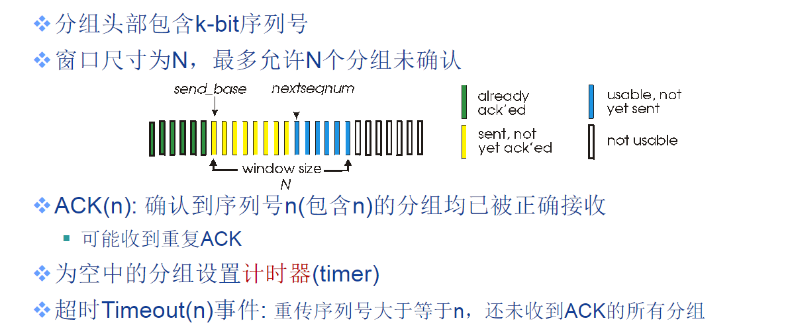

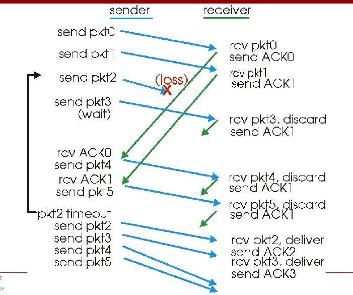

但是从请求出问题的报文之后全部重新发送，造成了较大的浪费。

### SR(Selective Repeat协议)

设置缓存机制，缓存乱序到达的分组。

给每个分组设置一个定时器，只发送未确定的分组。

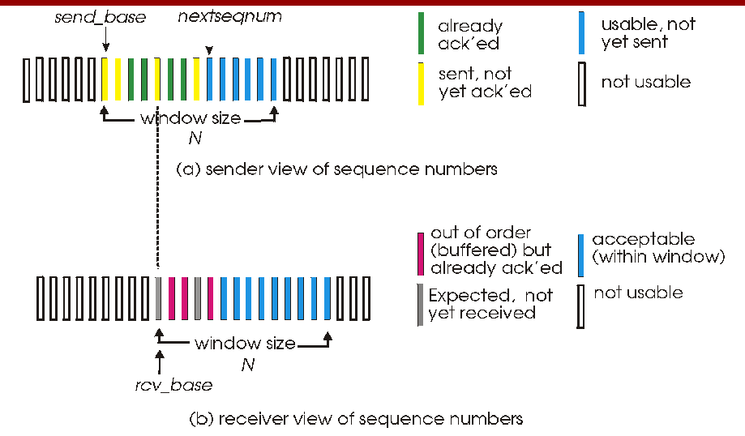

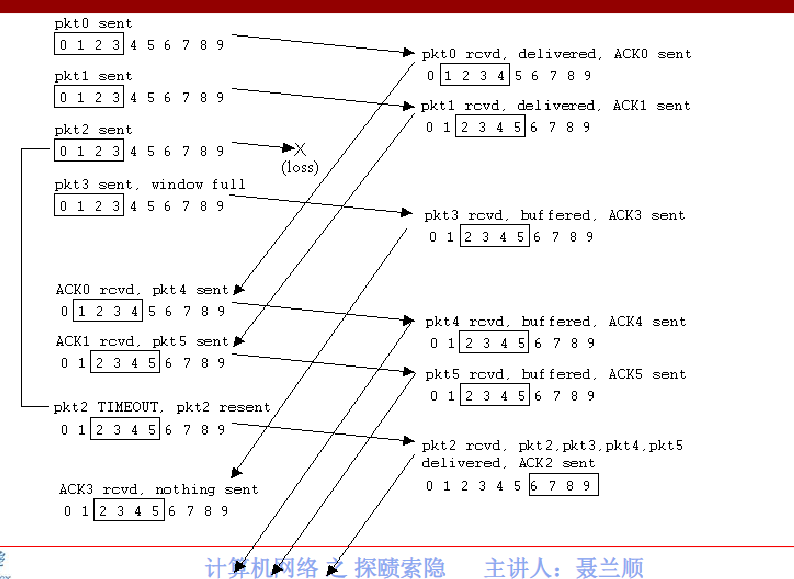

### TCP（可靠数据传输）

如果没有收到ACK2但是收到了ACK3，认为报文3之前（不包括报文3）的报文都被接收。

超时的报文启动重传机制。

能够由接收方正确处理乱序到达的报文。

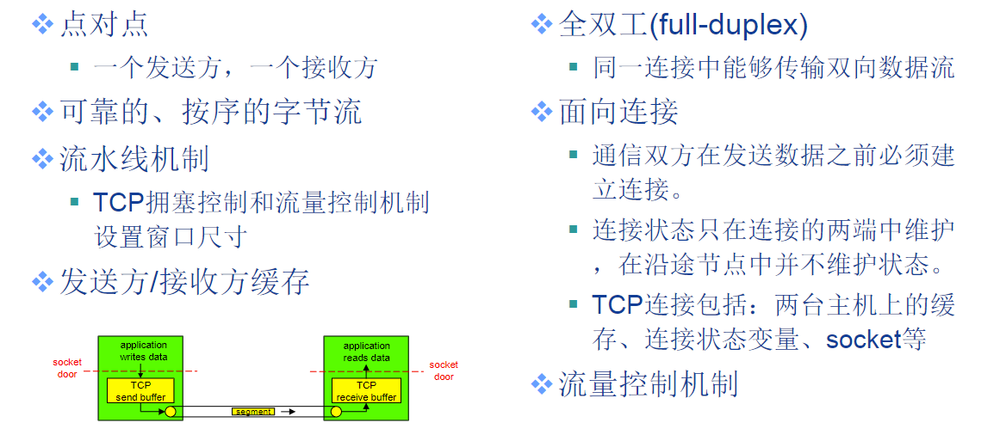

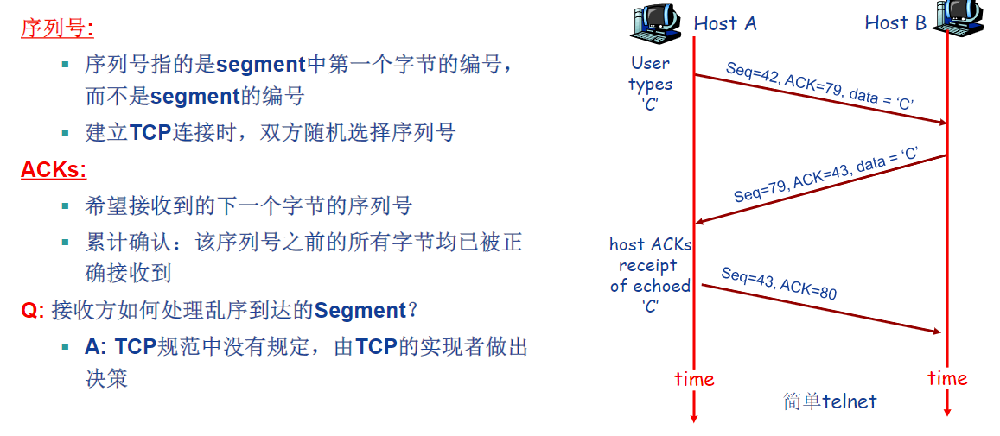

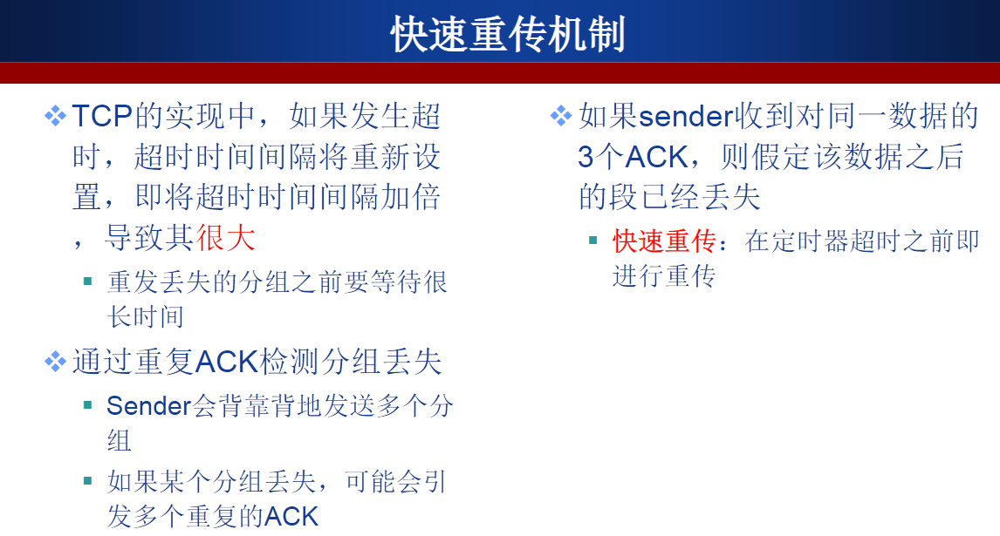

### TCP拥塞控制

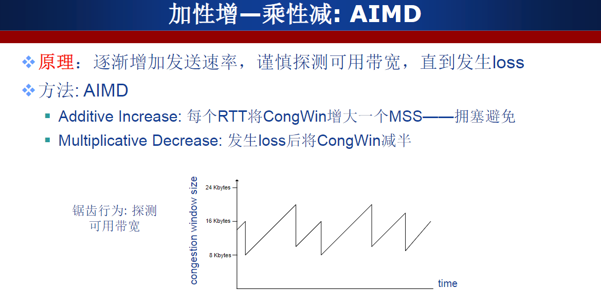

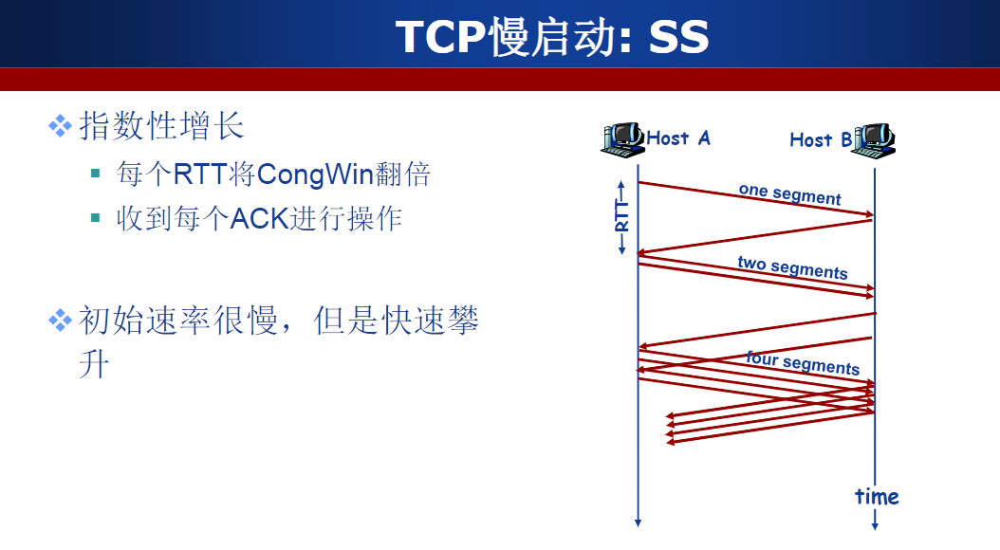

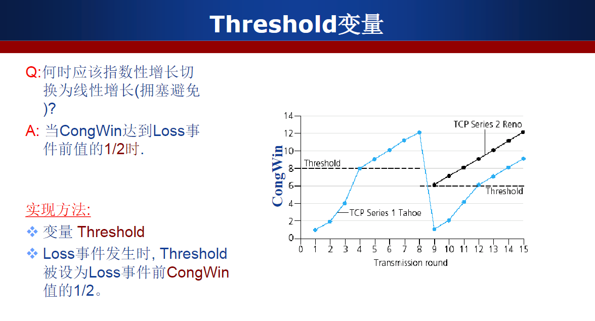

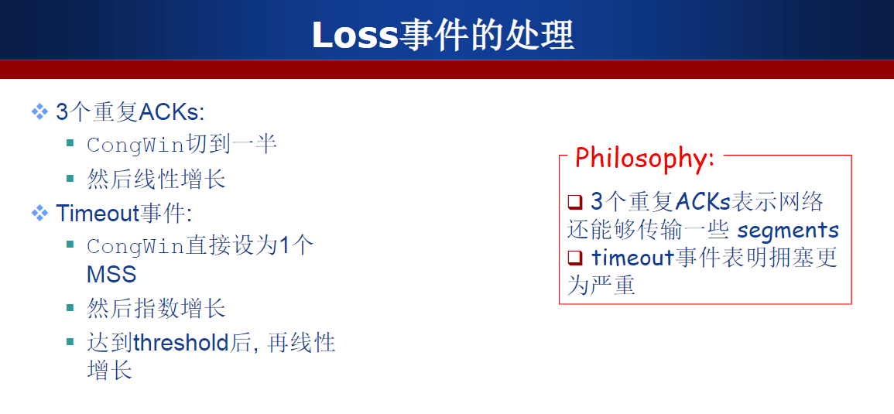

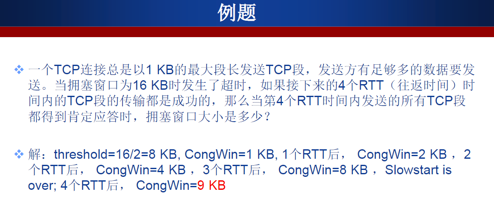

## 作业完成

一、 假设主机A向主机B发送5个连续的报文段，主机B对每个报文段进行确认，其中第二个报文段丢失，其余报文段以及重传的第二个报文段均被主机B正确接收，主机A正确接收所有ACK报文段；报文段从1开始依次连续编号（即1、2、3……），主机A的超时时间足够长。请回答下列问题：

> 1).如果分别采用GBN、SR和TCP协议，则对应这三个协议，主机A分别总共发了多少个报文段？主机B分别总共发送了多少个ACK？它们的序号是什么？(针对3个协议分别给出解答）

**解：**

**GBN： A共发送9个报文段,，B发送8个ACK** 

* A：首先发送1，2，3，4，5；等待报文2的ACK超时，再发送2，3，4，5。
* B：接收到1，3，4，5发送$ACK_1$，$ACK_1$，$ACK_1$，$ACK_1$，再接收到2，3，4，5再发送$ACK_2$，$ACK_3$，$ACK_4$，$ACK_5$。

**SR：A共发送6个报文段，B共发送5个ACK。**	

* A：先发送1，2，3，4，5；接收到1，3，4，5的$ACK_1$，$ACK_3$，$ACK_4$，$ACK_5$，等待报文2的$ACK_2$超时，重新发送报文2。
* B：首先接收1，3，4，5，并发送1，3，4，5的$ACK_1$，$ACK_3$，$ACK_4$，$ACK_5$，然后接收到了报文2，发送报文2的$ACK_2$。

**TCP：A共发送6个报文段，B共发送5个ACK** （TCP 采用累计确认的方式）

* A：首先发送1，2，3，4，5；接收$ACK_3$超时，重新发送报文2
* B：接收到报文1，发送$ACK_2$，之后接收到报文3，4，5，没有收到报文2，发送3个$ACK_2$，接收到报文2后，发送$ACK_6$，表示报文5及其之前的报文全部被接收。

> 2).如果对上述三个协议，超时时间比5RTT长得多，那么哪个协议将在最短的时间间隔内成功交付5个报文段？

**解：** TCP用时更短，由于TCP具有快速重传机制，可以在定时器超时之前就重传丢失的报文。

二、 假设A、B两个端系统通过唯一的一条8Mbps链路连接（M=10^6），该链路的双向传播时延是150ms；A通过一个TCP连接向B发送一个大文件，B的接收缓存足够大，每个TCP段最大段长度（MSS）为1500字节，TCP采用Reno版本，且总是处于拥塞避免阶段（即忽略慢启动）。请回答下列问题：

> 1).该TCP连接能够获得的最大窗口尺寸（以TCP段数计）是多少？

**‏解：**

设 WindowSize 是最大窗口尺寸，当最大发送速率超过链路带宽时会发生丢包，RTT 是一个往返的时间（传播时延）

 
$$
WindowSize*MSS/RTT = 8Mbps
$$

$$
WindowSize = 8M * 0.15 / (1500 * 8) = 100
$$

当$WindowSize=100$，是最大窗口尺寸，再大传输的数据带宽将超过链路带宽，造成丢包。

> 2).该TCP连接的平均窗口尺寸（以TCP段数计）和平均吞吐量（以bps计）是多少？

 

**‏解：**

 

忽略慢启动，总是处于拥塞避免阶段，数据传输的窗口大小将在$[0.5*WindowSize,WindowSize]$之间变化。

 
$$
\overline{WindowSize} = (0.5*WindowSize + WindowSize) / 2 = 0.75*WindowSize=75
$$

$$
\overline{平均吞吐量}=\overline{WindowSize}*MISS/RTT=75*1500*8/0.15=6Mbps
$$

> 3).该TCP连接的拥塞窗口从发生丢包到恢复到最大窗口尺寸要经历多长时间？

**解：**

发生丢包后，窗口尺寸减为最大窗口尺寸的一半，每个RTT增加一个MISS。
$$
\Delta t = (WindowSize/2)RTT=50 * 0.15 = 7.5s
$$